# Lab: Blind SQL Injection — Conditional Errors

## Objective
Exploit a blind SQL injection vulnerability to:
- Detect SQL injection using database errors
- Use conditional errors to infer data
- Extract the administrator password
- Log in as the administrator user

--- 
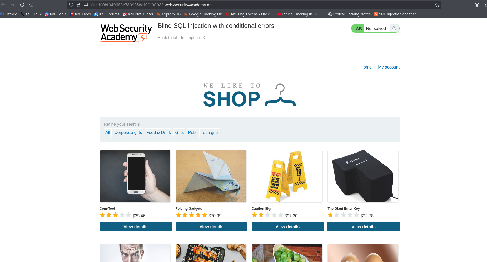

---

## Steps

1. Open the lab website.
2. Intercept the request using Burp Suite.
3. Locate the `TrackingId` cookie.
4. Inject payloads to trigger conditional database errors.

---
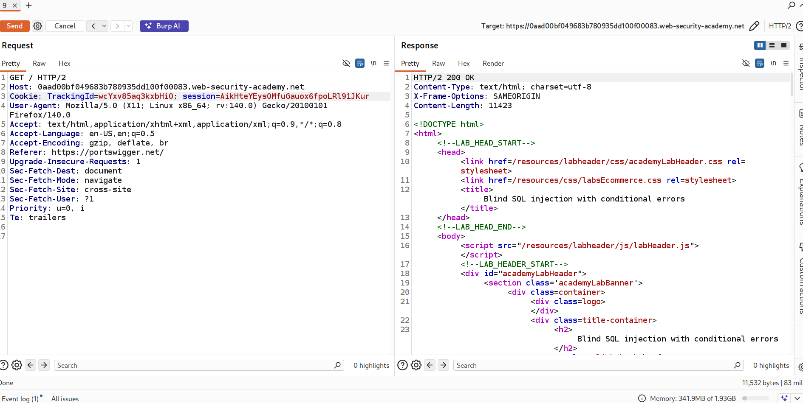

---

### Since we cannot see database query results in the HTTP response, and the response does not change when modifying the `TrackingId`, we cannot use normal conditional responses.

### If we try injecting the following:
#### `xyz'`

#### It causes an internal server error because the query becomes syntactically incorrect:
#### SELECT * FROM trackedusers WHERE trackingid='xyz'
#### → SELECT * FROM trackedusers WHERE trackingid='xyz''

### Therefore, we can use **conditional errors** to extract or infer sensitive data.

---

## Steps Overview

### 1) Identify the database type  
### 2) Determine the password length for the administrator user  
### 3) Extract the password  
### 4) Log in as the administrator  

---

## Step 1: Identify Database Type

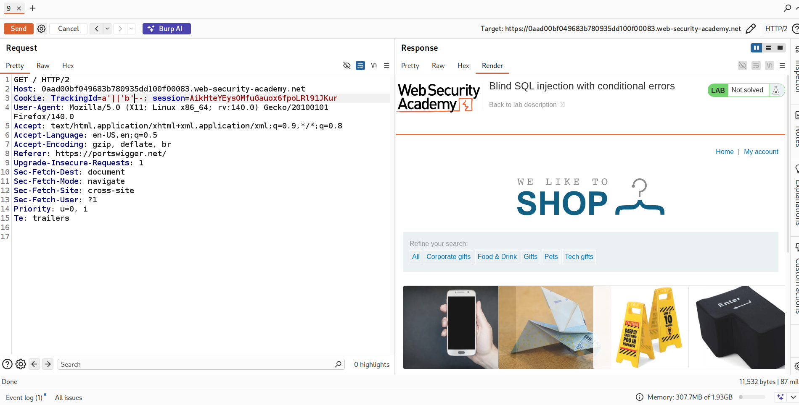

#### There are databases that use `||` for string concatenation, one of them is Oracle.

#### To confirm that it is an Oracle database, we use the `dual` table:

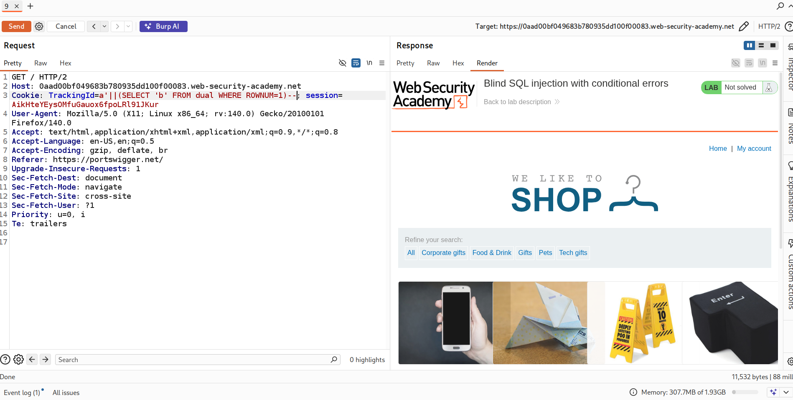

##### `ROWNUM` is used to limit the number of returned rows. Here we use it to ensure proper concatenation.

---

## Step 2: Trigger Conditional Errors

#### To create a conditional error, we use the `CASE` statement:

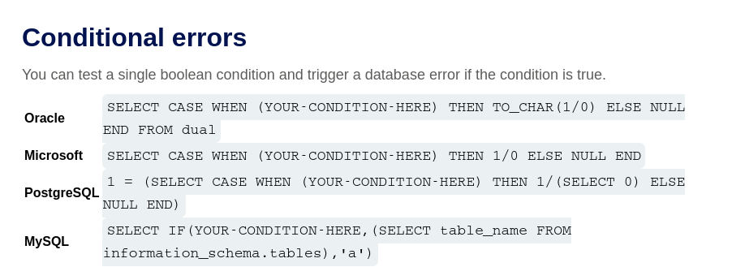

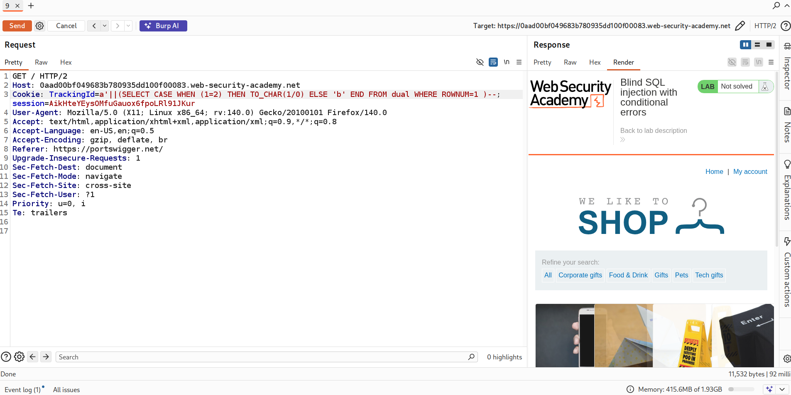

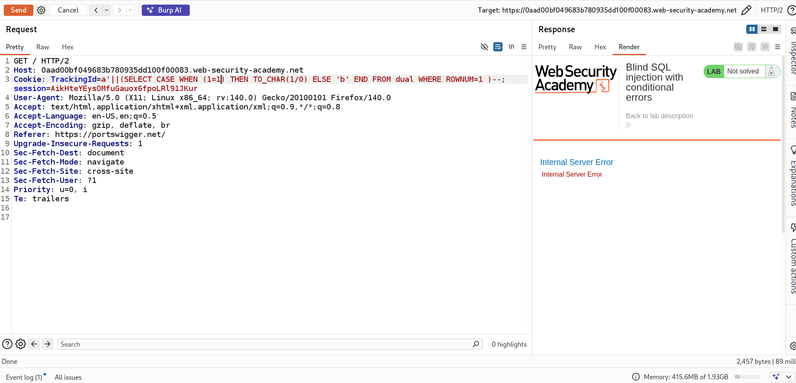

---

### Check if the administrator user exists:

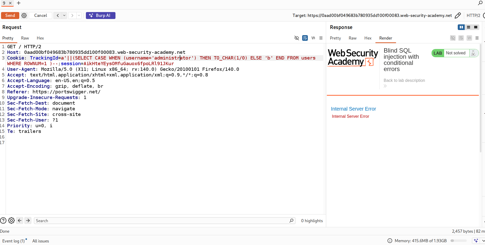

---

### Find the password length using `LENGTH()`:

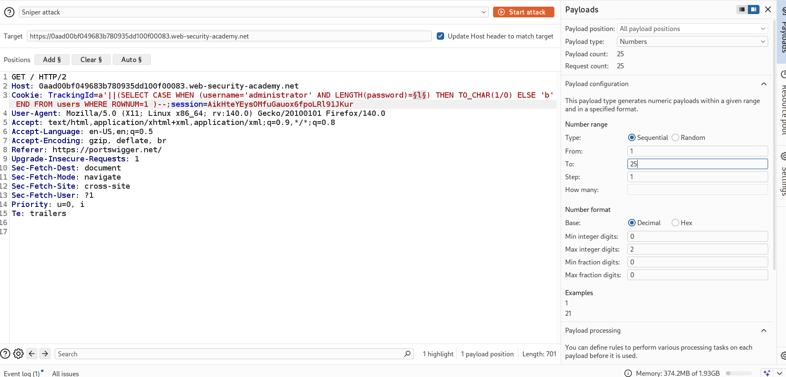

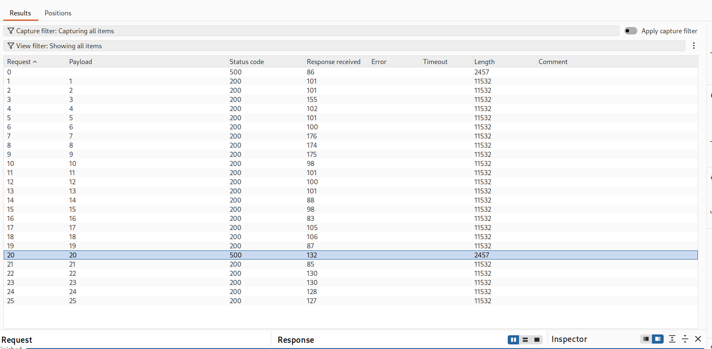

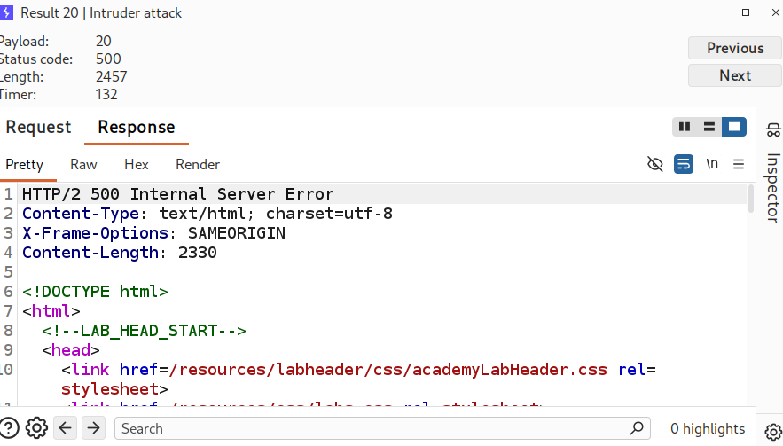

---

## Step 3: Extract the Password

#### To extract the password, we use `SUBSTR` and perform a brute-force attack using Burp Suite Intruder:

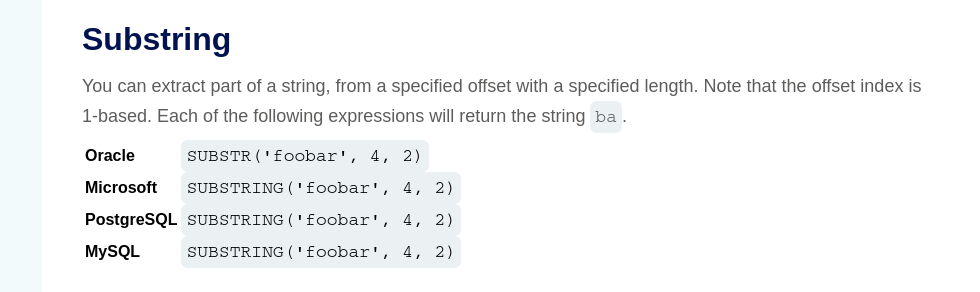

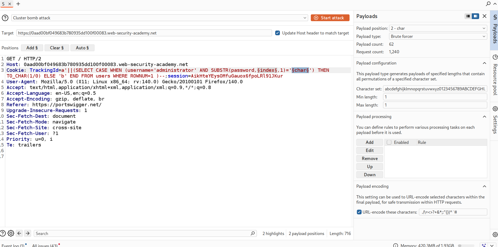

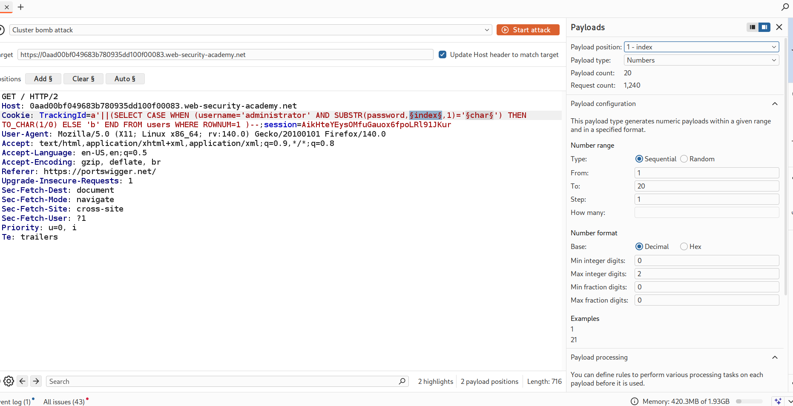

##### **Index** refers to the position of the character inside the password string.

#### We use a **Cluster Bomb attack** to try all possible combinations.

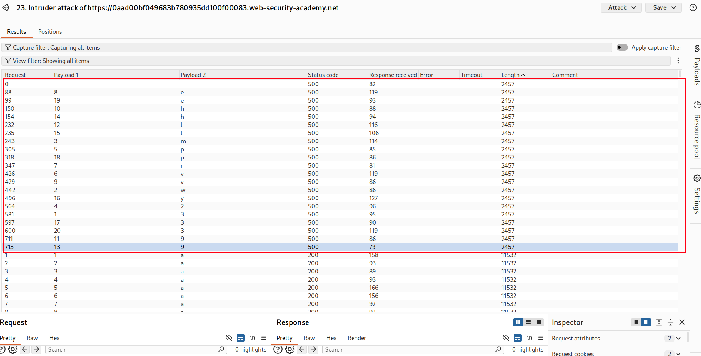

#### Notice:
- Response length `11532` → Status `200 OK` (no error)
- Response length `2457` → Internal Server Error

#### This difference helps us identify the correct character.

---

## Step 4: Login as Administrator

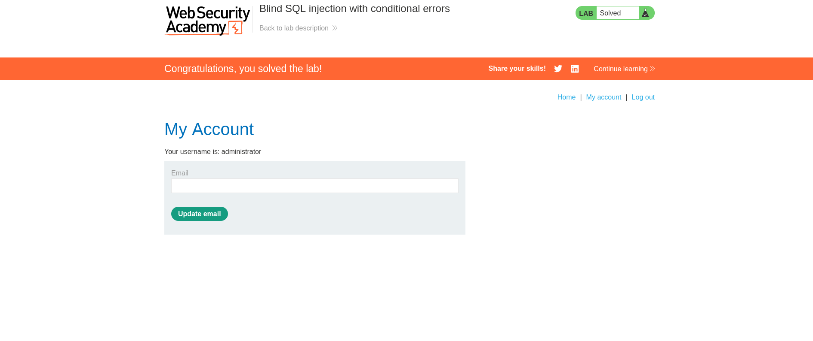
