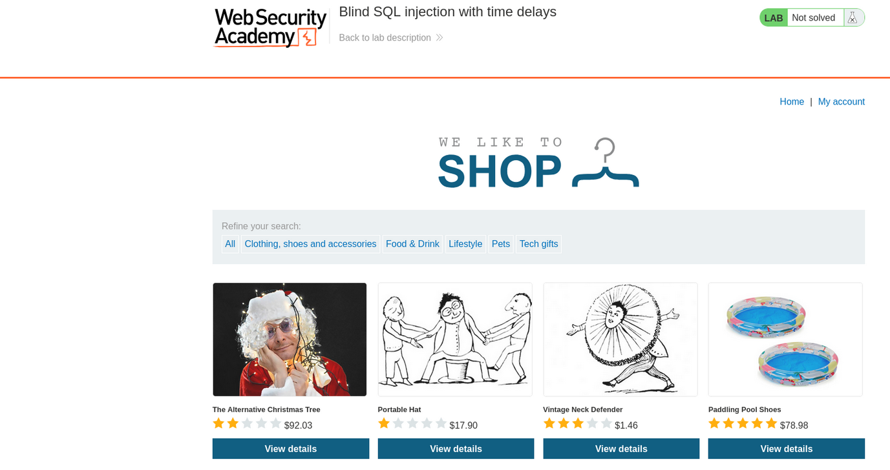
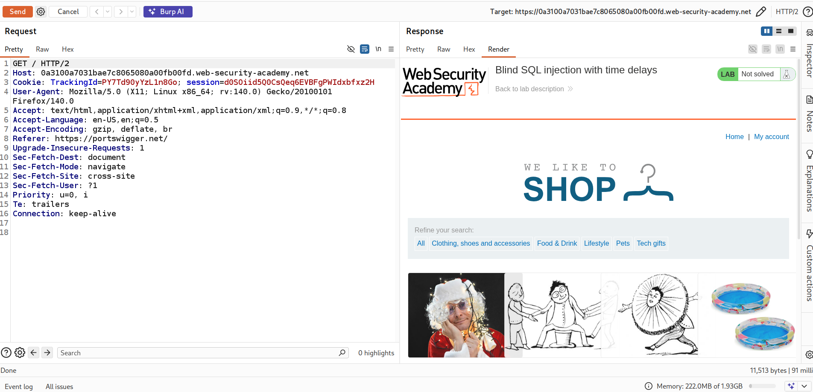
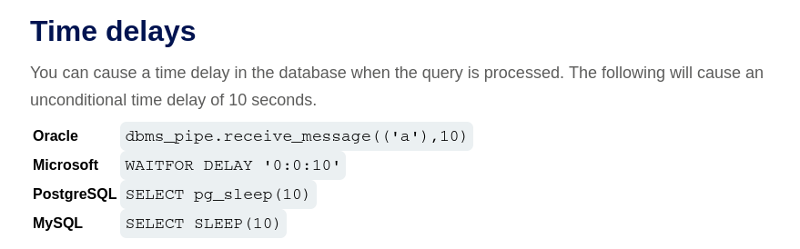
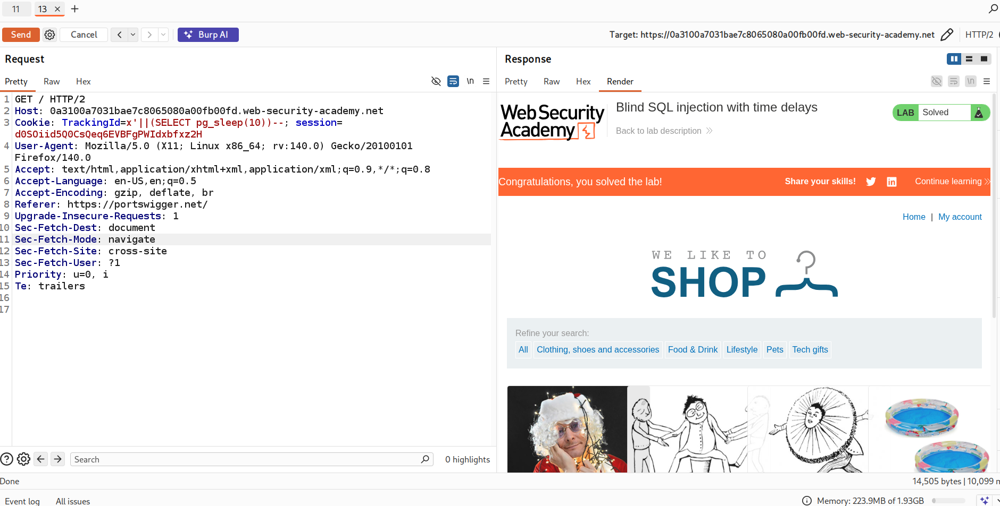

# Lab: Blind SQL Injection — Time Delays

## Objective
Exploit a blind SQL injection vulnerability to:
- Confirm SQL injection using time delays
- Force the application to pause execution
- Prove conditional time-based behavior

---

---
## Lab Overview

In this lab:
- The application does **not show errors or data**
- The response looks identical for all inputs
- We must rely on **response time delays** to detect SQL injection

---

## Step 1: Identify Injection Point

Intercept the request and locate the `TrackingId` cookie.

---
### Test basic injection:
Id=xyz'

### Result:
- No visible change in response

#### Possible blind SQL injection point

---

## Step 2: Trigger a Time Delay

We attempt to force the database to sleep.

### since we don't clearly know database type , lets try all four statments for 4 databases(oracle,mysql,postgre,microsoftsql)

### after trying postgresql database:
 

