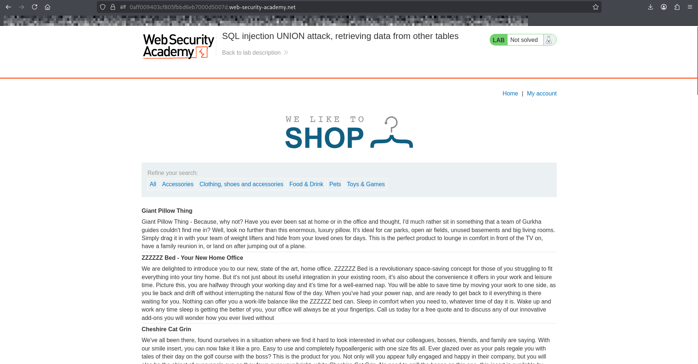
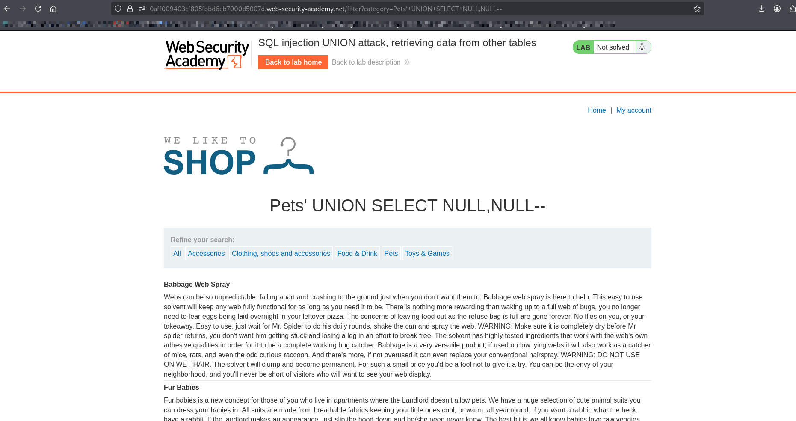
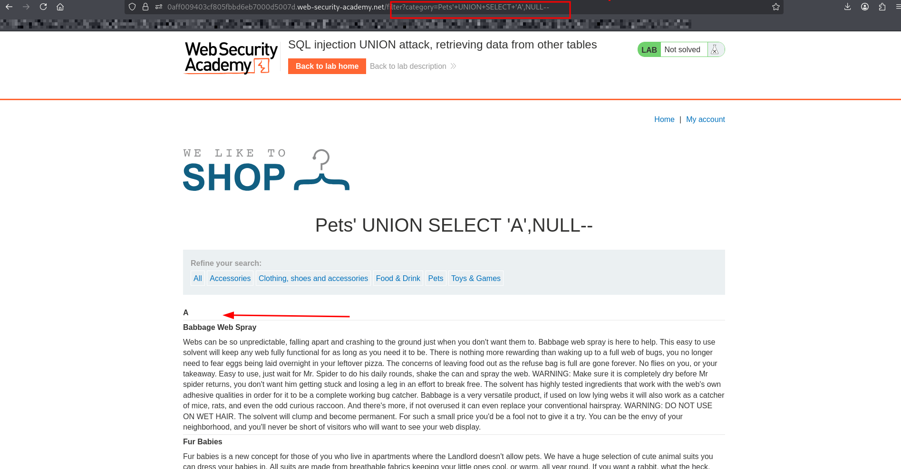
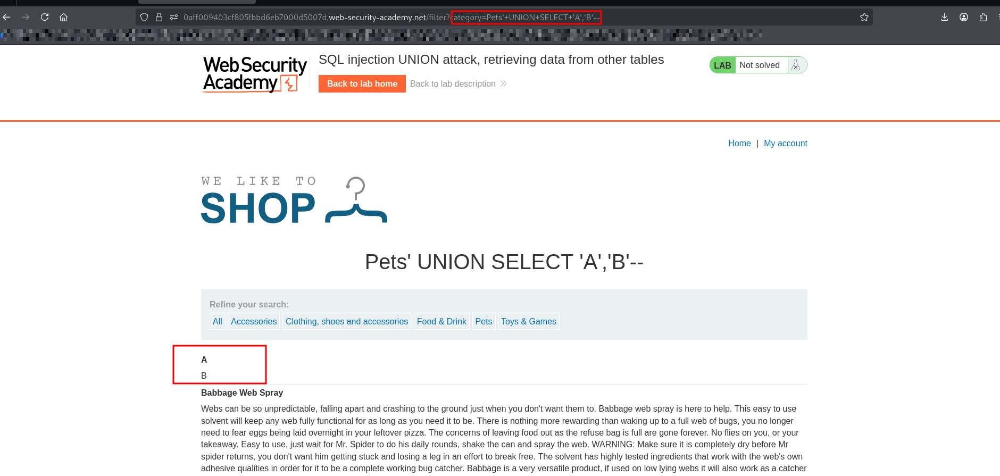
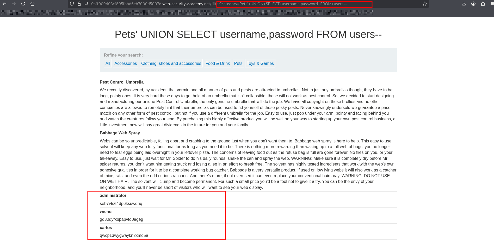
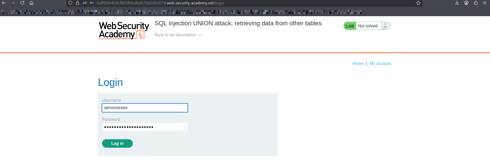
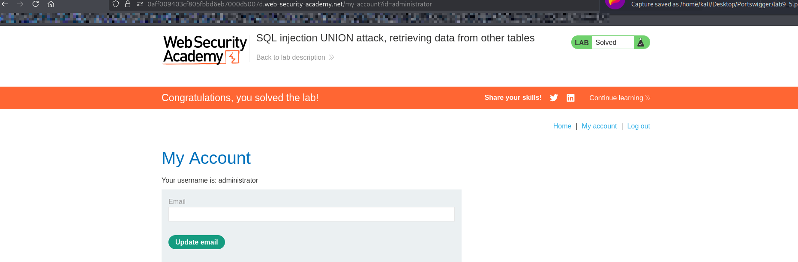

# Lab: SQL Injection — UNION Attack (Retrieving Data from Other Tables)

## Objective
Use a UNION-based SQL injection to retrieve data from another table (`users`) and log in as the **administrator**.

---

## Steps

1. Open the lab website.
2. Navigate to a product category (e.g., "Gifts").
3. inject the payload here on url:

---

## Step 1: Determine Number of Columns Using UNION SELECT

### ' UNION SELECT NULL,NULL,NULL--
#### If no error → correct number of columns 

## BUT WE NEED FIRST KNOW WHICH TYPE OF DATABASE USED:

### IF its oracle database we should use dual table 

### ' UNION SELECT NULL,NULL,NULL FROM dual--

### ' UNION SELECT NULL,NULL,NULL--

## SO ITS NOT ORACLE DATABASE

---

## Step 2: Find Column That Accepts Text

### Replace each NULL with a string: 'A'

---

## Step 3: retrieves all usernames and passwords using username , password form users

---

## Step 4: login as administrator

## Explanation
## UNION combines results from the original query with another query
## username,password retrieves credentials from the users table
## The data is displayed in the application response

### What I Learned
#### How to extract data from other tables using UNION
#### How to enumerate table columns (username, password)
#### How SQL injection can expose sensitive data
#### Real-world impact: account takeover

