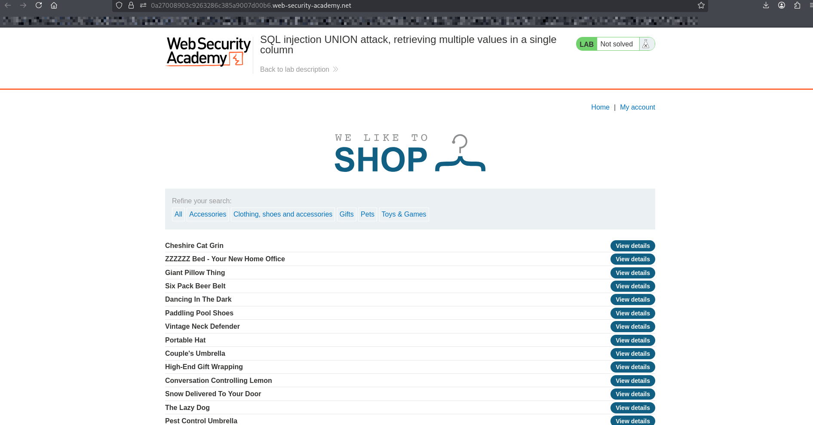
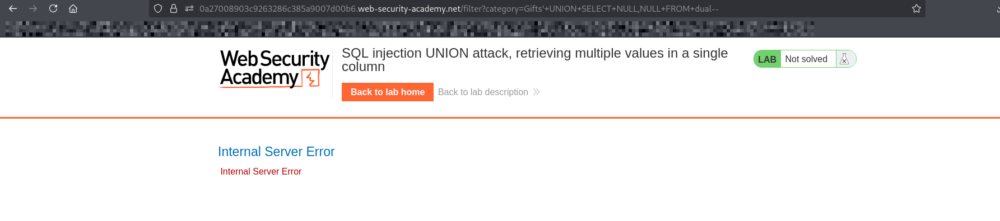
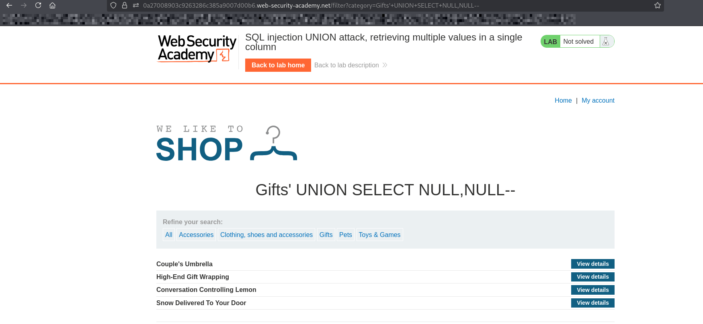
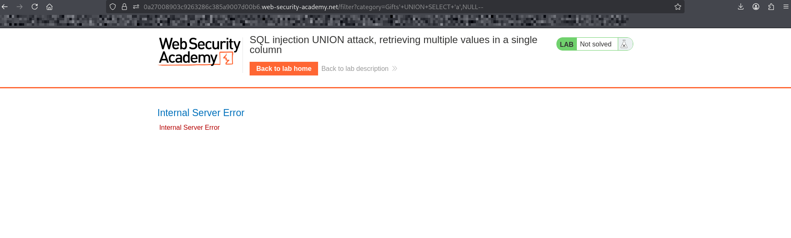
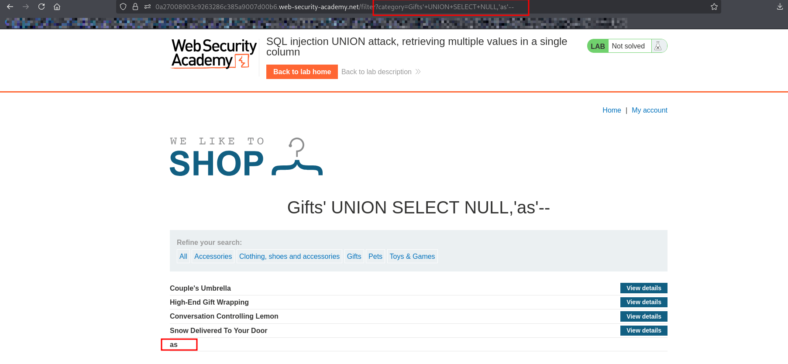
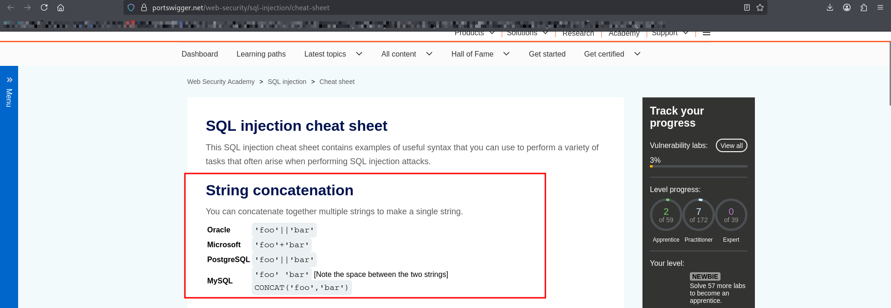
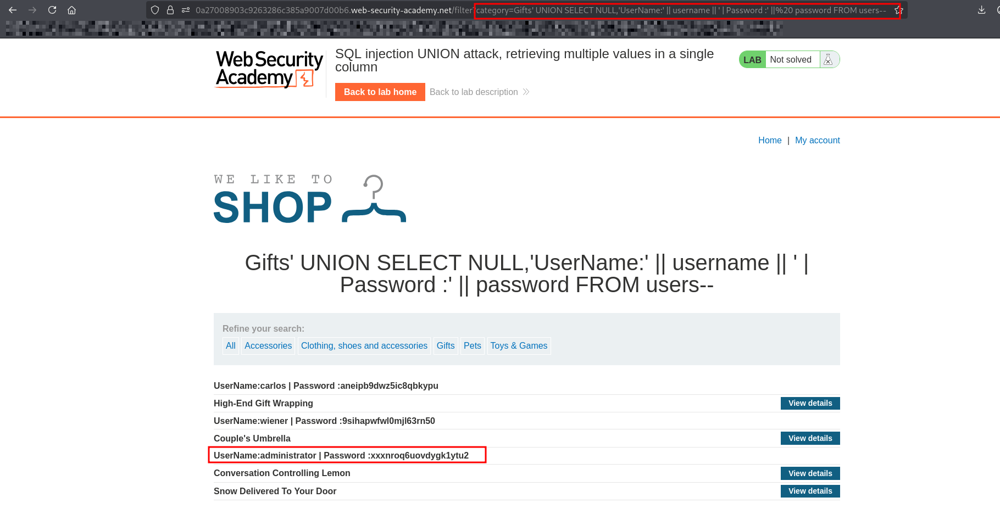
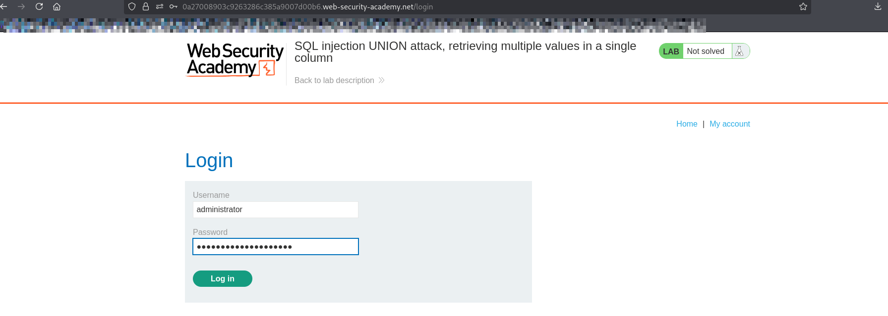
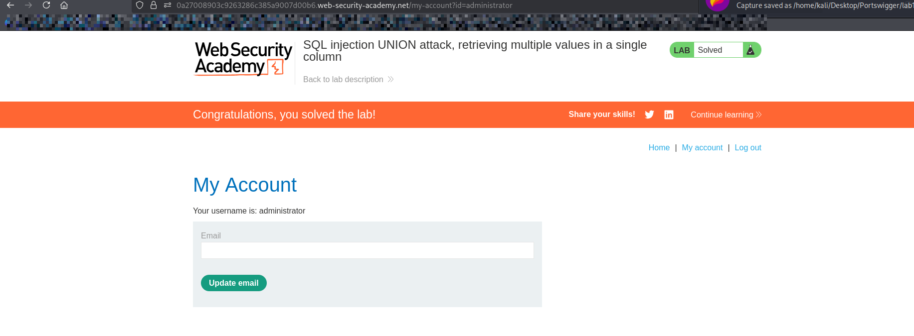

# Lab: SQL Injection — UNION Attack (Retrieving Multiple Values in a Single Column)

## Objective
Use a UNION-based SQL injection to retrieve **username and password in a single column**, then log in as the **administrator**.

---

---

## Steps

1. Open the lab website.
2. Navigate to a product category (e.g., "Gifts").
3. inject the payload here on url

---

## Step 1: Determine Number of Columns Using UNION SELECT

## FIRST WE NEED TO KNOW WHICH TYPE OF DATABASE USED:

### IF its oracle database we should use dual table 

### ' UNION SELECT NULL,NULL FROM dual--

### ' UNION SELECT NULL,NULL,NULL--

## SO ITS NOT ORACLE DATABASE

---

## Step 2: Find Column That Accepts Text

### Replace each NULL with a string: 'A'

---

## Step 3: retrieves all usernames and passwords using username , password form users

## but we have only one column that is compatible with string

### go to sql injection cheet sheet:

#### Concatenation = joining strings together

####  Think of it like this:
#### "admin" + ":" + "1234"  →  "admin:1234"

#### In SQL

#### You combine columns like:
#### username || ':' || password

### so we are going to use concatination  for merging username and password to each other
### SINCE ITS NOT ORACLE DATABASE WE NEED TO KNOW THE APPROPRIET ONE BY TRYING ALL 
### I FOUND THE DATABASE IS postgre DATABASE

' UNION SELECT NULL,'USERNAME: ' || username || '| Password: ' || password FROM users--

---
## Step 4: login as administrator
###  Find the line containing:
### username: administrator
### Copy the password
### Go to the login page
### Log in using the extracted credentials

---

## What I Learned
## How to concatenate multiple columns into one using ||
## How to bypass column limitations in UNION attacks
## How to extract sensitive data even with output restrictions
## Real-world impact: credential disclosure and account takeover
