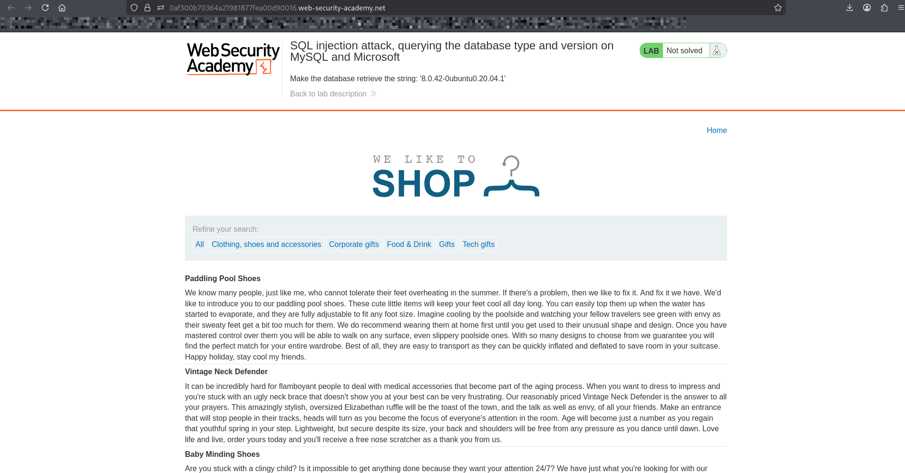
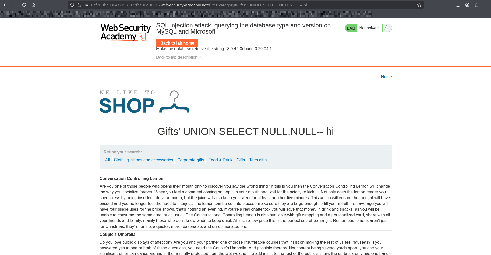
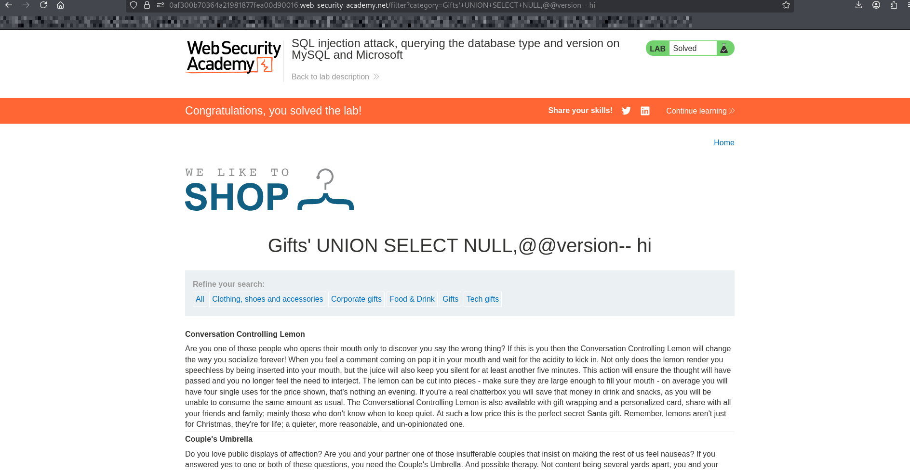

# Lab: SQL Injection — Querying the Database Type and Version (MySQL and Microsoft)

## Objective
Exploit a SQL injection vulnerability to retrieve the **database version string** from a MySQL or Microsoft SQL Server database.

---

## Steps

1. Open the lab website.
2. Navigate to a product category (e.g., "Gifts").
3. injects payload into url after category value:

---

## Step 1: Determine Number of Columns Using UNION SELECT

### since its might be Microsoft or MySQL database:

#### lets try both payloads:

#### ' UNION SELECT NULL,NULL-- 
#### ' UNION SELECT NULL,NULL-- HI

---

## Step 2: determine database version 

### GO to sql injection cheet sheet

### now lets use it with our payload : ' UNION SELECT NULL, @@version-- HI

---

## Explanation
### @@version is a built-in function/variable that returns the database version
### Works in both MySQL and Microsoft SQL Server
### UNION SELECT allows combining this query with the original one
### The result is displayed in the application's response

---

## What I Learned
### How to identify MySQL and Microsoft SQL Server using SQL injection
### How to use @@version to retrieve database version
### How UNION attacks can be used to extract system information
### Differences in database-specific version retrieval techniques
