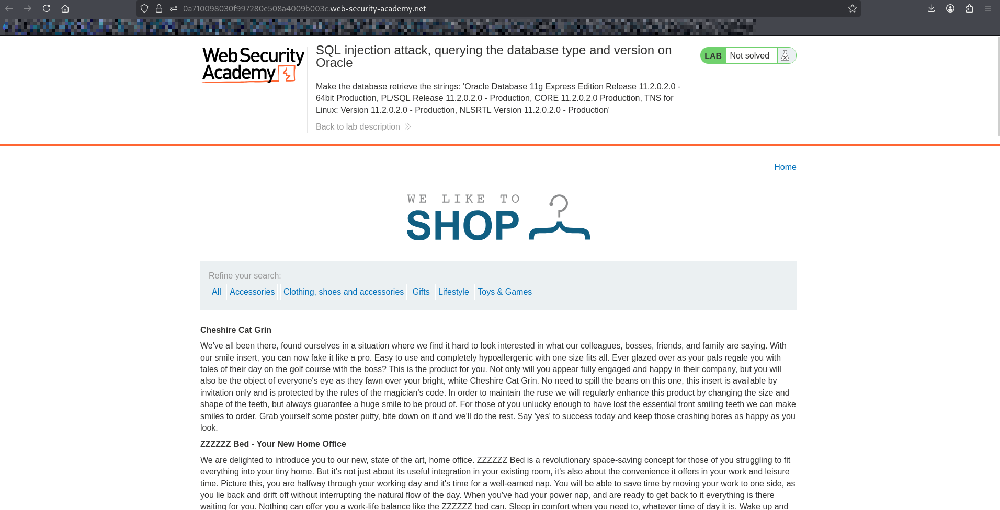
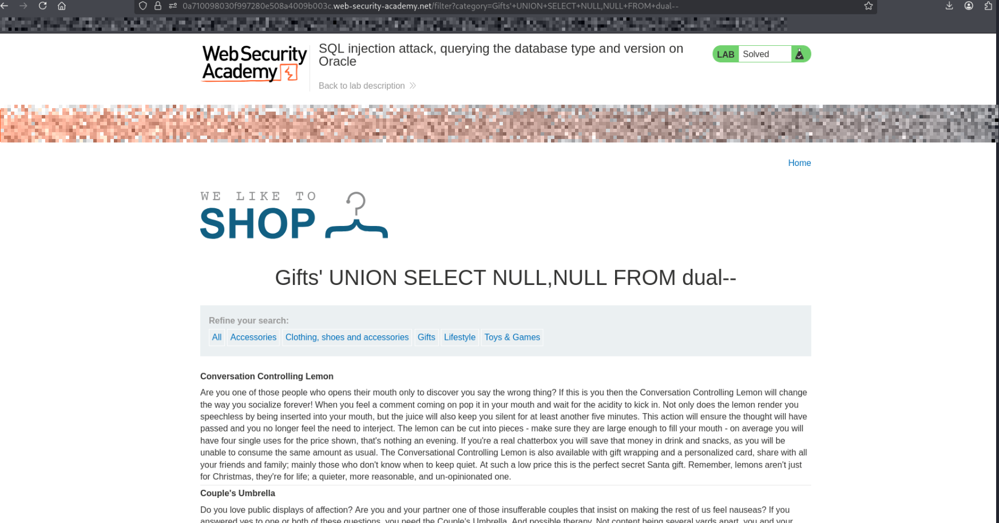
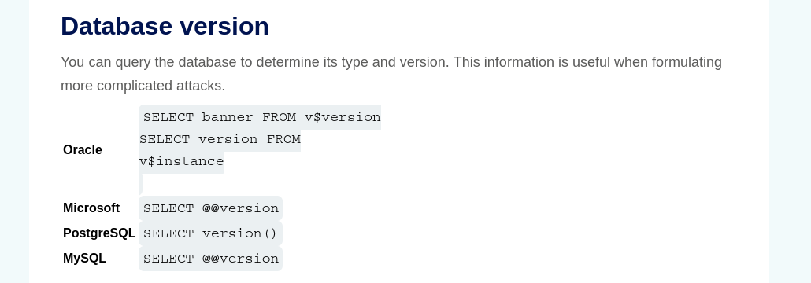
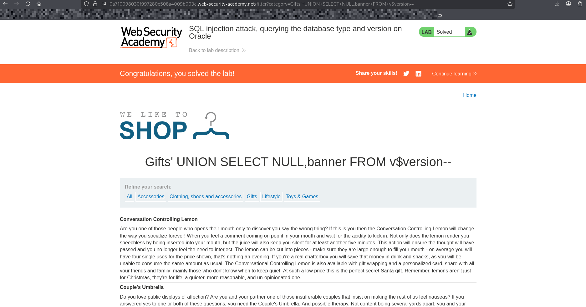

# Lab: SQL Injection — Querying the Database Type and Version (Oracle)

## Objective
Exploit a SQL injection vulnerability to determine the **database type and version** on an Oracle database.

---

## Steps

1. Open the lab website.
2. Navigate to a product category (e.g., "Gifts").
3. injects payload into url after category value:

---

## Step 1: Determine Number of Columns Using UNION SELECT

### since its oracle database so we need to use dual table 
### 'UNION SELECT NULL,NULL FROM dual--

---

## Step 2: determine database version 

### GO to sql injection cheet sheet

### select one of the two query to use it 

### now lets use it with our payload : 'UNION SELECT NULL,banner FROM v$version--

---

## Explanation

### v$version is an Oracle system view that contains version information
### banner column includes database version details
### dual is a dummy table used in Oracle queries
### UNION SELECT allows us to combine our query with the original one

---

## What I Learned

### How to identify Oracle databases using SQL injection
### How to use v$version to retrieve database version
### The use of dual table in Oracle queries
### How database-specific syntax differs across DBMS
