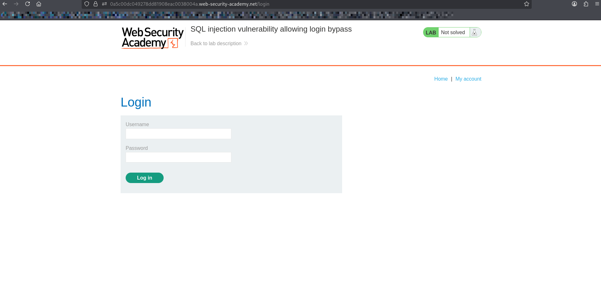
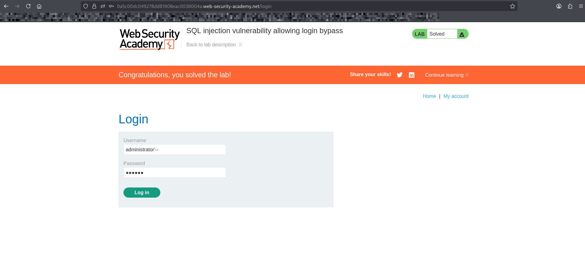
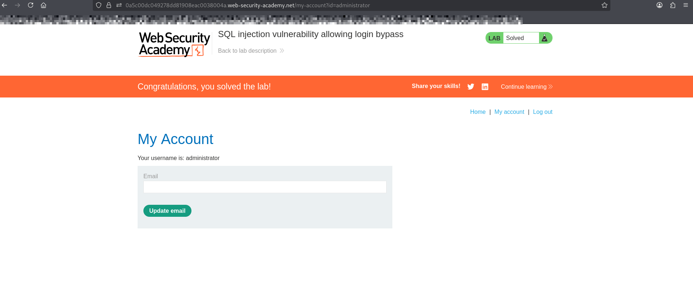

# Lab: SQL Injection — Login Bypass

## Objective
Exploit a SQL injection vulnerability in the login form to bypass authentication and gain access.

---

## Payload used
### '--

---

## sql login query is likely structured as:
### SELECT * FROM users WHERE username='administrator' AND password='123'

---

## Steps

---
### Open Login Page

---

### Inject Payload into username field

---

### result

---
## Explanation
The payload:
- Closes the username string
- Comments out the rest of the query using `--`
- So we ignore the password  so we get logged in successfully
---

## What I Learned
- How SQL Injection can bypass authentication
- How login queries are constructed
- How to manipulate input to alter SQL logic

---
