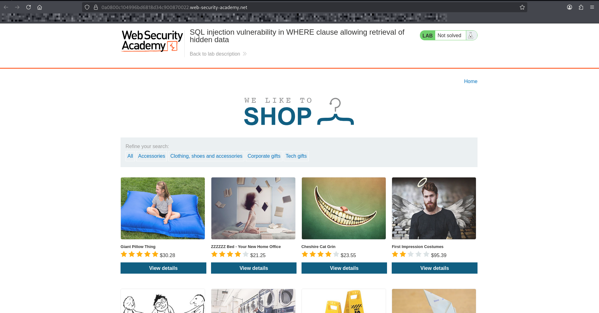
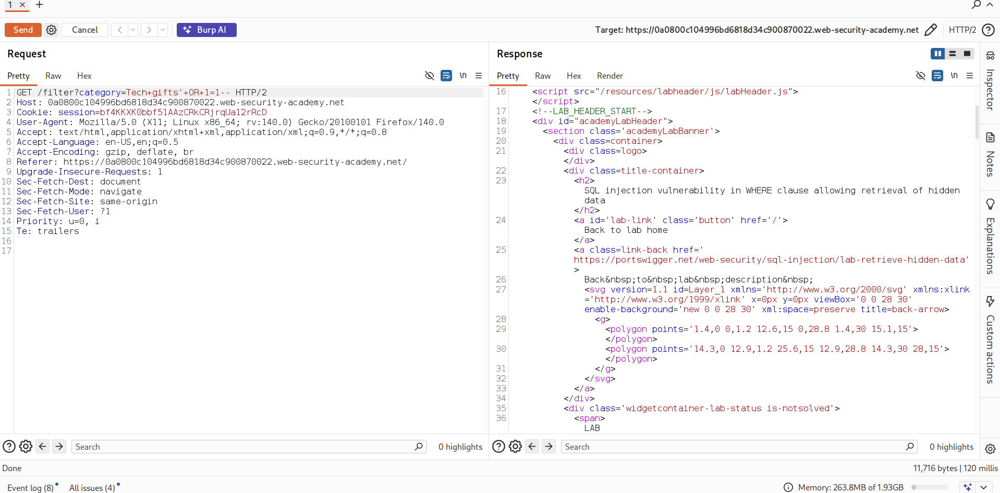
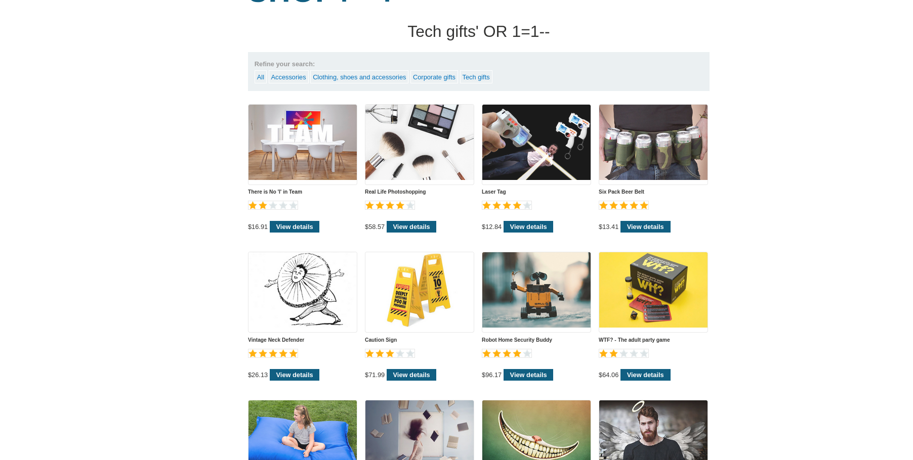

# Lab: SQL Injection — WHERE Clause (Hidden Data Retrieval)

## Objective
Exploit a SQL injection vulnerability in the WHERE clause to retrieve hidden data that is not normally visible.

---

## Tools Used
- Burp Suite (Proxy & Repeater)
- Browser

---

## Steps

1. Open the lab website.
2. Click on a product category or filter (e.g., "All", "Gifts", etc.).
3. Intercept the request using Burp Suite Proxy.
4. Send the request to Repeater.
5. Identify the parameter used in the SQL query (e.g., category filter).
6. Inject a SQL payload to modify the WHERE clause.
7. Forward the request and observe hidden products appearing.

---

## Payload
### ' OR 1=1 --

---

## Explanation
The application uses user input directly inside a SQL WHERE clause.

Original logic (example): 
SELECT * FROM products WHERE category = 'Gifts'

After injection:
SELECT * FROM products WHERE category = '' OR 1=1 --'

- `'` closes the original string
- `OR 1=1` makes the condition always true
- `--` comments out the rest of the query

As a result, the database returns all products, including hidden ones.

---

## Screenshot

---

## What I Learned
- How SQL injection works in WHERE clauses
- How to manipulate SQL queries to bypass filters
- How `OR 1=1` affects query logic
- Importance of parameterized queries and input validation

---
