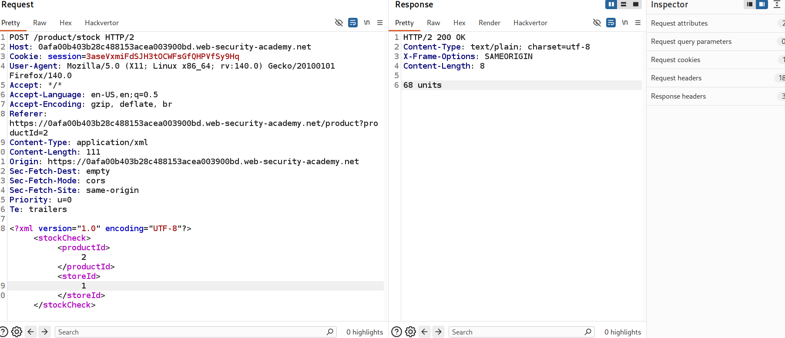
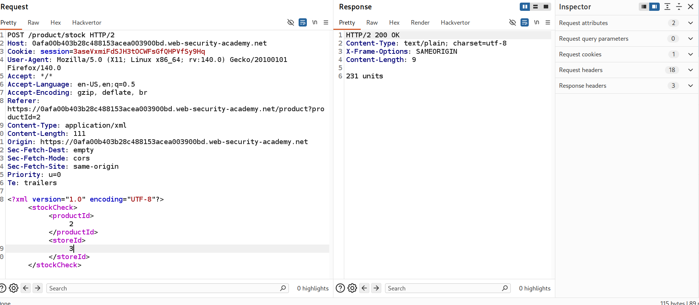
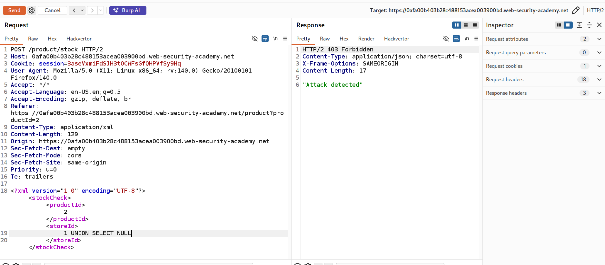
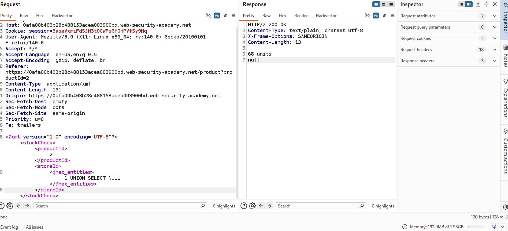
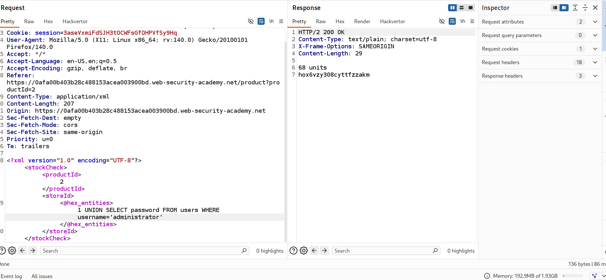
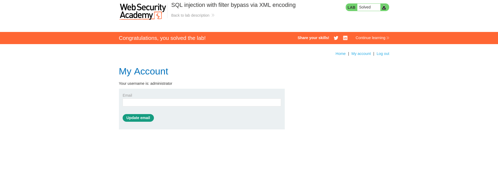

# Lab: SQL Injection with Filter Bypass via XML Encoding

## Objective
Exploit a SQL injection vulnerability to:
- Bypass input filtering using XML encoding
- Perform a UNION-based SQL injection
- Extract the administrator's credentials
- Log in as the administrator user

---

---

## Lab Overview

In this lab:
- The application processes user input inside **XML**
- The response **returns query results**
- Input filtering blocks standard SQL injection payloads
- However, the filter can be bypassed using **XML encoding**

## This allows us to perform a **UNION-based SQL injection**

---

## Step 1: Identify Injection Point

Intercept the request using **Burp Suite**.

### Request body:
xml
<stockCheck>
  <productId>1</productId>
  <storeId>1</storeId>
</stockCheck>

---

Step 2: Test for SQL Injection

Modify the storeId value:

<storeId>1'</storeId>
Result:
Application returns an error

### Confirms SQL injection vulnerability

---

---
## Step 3: Bypass Filter Using XML Encoding

Direct payloads like:
1 UNION SELECT NULL

are blocked by the application filter.

---

### Using Hackvertor Extension

To bypass this filter, I used the **Hackvertor** extension in Burp Suite.

- Selected the payload

- click right click choos hackvertor then encode then hex entities
- 
- Encoded it using **Hex Entities encoding**

---

--- 
## no lets inject our payload to get administrator's password

### login 

