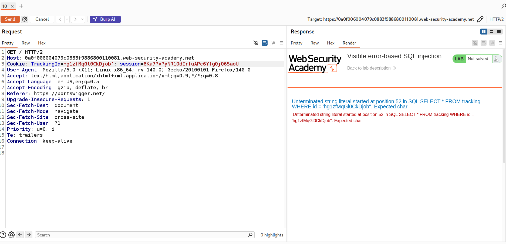
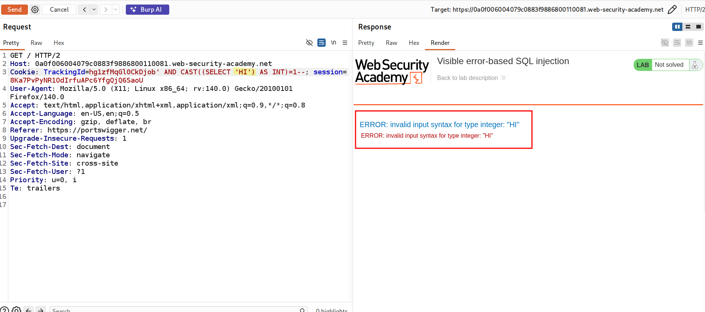
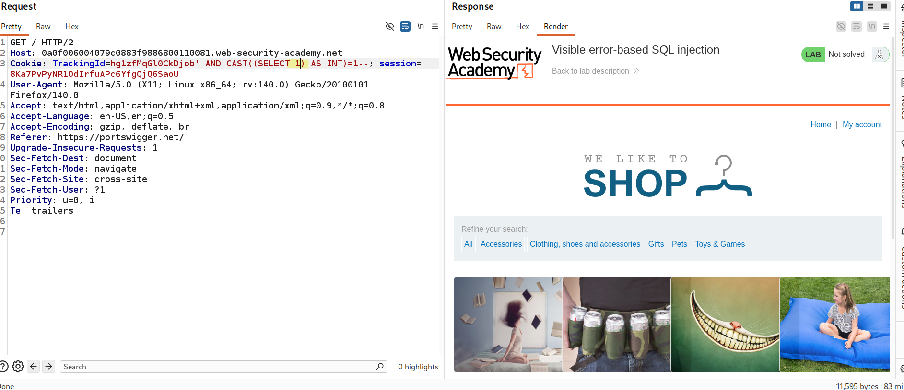
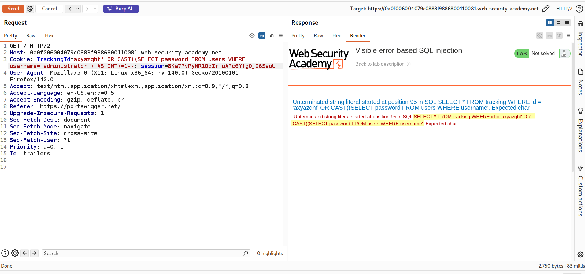
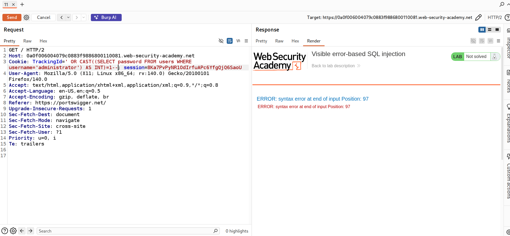
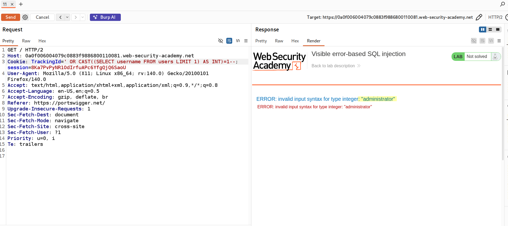
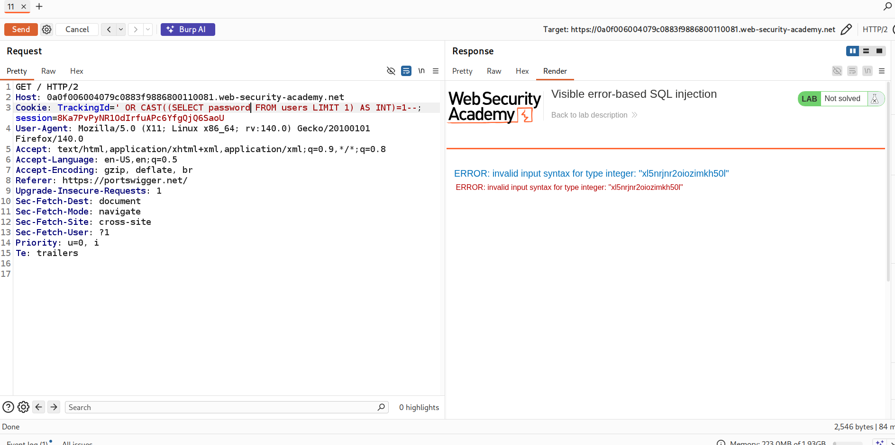
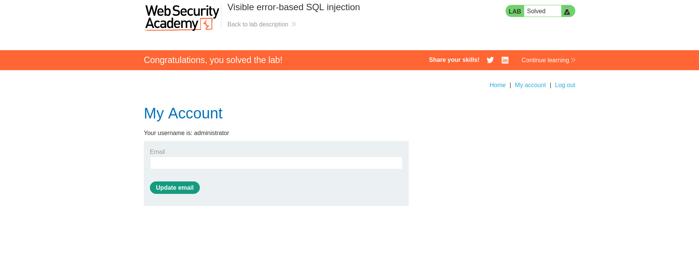

# Lab: Visible Error-Based SQL Injection

---

## Objective
Exploit a SQL injection vulnerability to:
- Trigger database errors that reveal sensitive data
- Extract the administrator password from error messages
- Log in as the administrator user

---

## Lab Overview

In this lab:
- The application returns **visible database error messages**
- These errors include **query results inside them**
- We can exploit this to directly extract sensitive data

## This is known as **Visible Error-Based SQL Injection**

---

## Step 1: Identify Injection Point

Intercept the request and locate the `TrackingId` cookie.

### Test basic injection:

### Result:
- The application returns a **database error**

### Explanation:
The query becomes invalid because we added `'`:

#### This breaks the SQL syntax.

### Visible error-based SQL injection confirmed

---

## Extract Data using CAST() Function

#### The `CAST()` function is used to convert data from one type to another.

#### Example:
CAST(200 AS CHAR)

### Converts an integer to a string

#### Example:
CAST('hi' AS INT)

#### This causes an error:
ERROR: invalid input syntax for type integer: "hi"

#### From this, we can use `CAST()` to intentionally trigger errors and extract sensitive data.

---

---

## Extract Administrator Password

### Now, let's extract the password from the `users` table for the administrator user:

#### A SQL error is returned.

#### Notice:
- The query is truncated due to a character limit.

---

### Solution: Remove unnecessary input

---

### Issue: Syntax Error at End of Input

#### While attempting to extract the password, the following error appeared:
ERROR: syntax error at end of input at position 95

#### Explanation:
- This error indicates that the SQL query was **cut off (truncated)** before it was completed.
- The database expected more input, but the query ended prematurely.
- The position (e.g., 95) refers to the exact character index where the parser detected the issue.

---

### Why This Happens

- The application likely enforces a **maximum length limit** on the input
- Our injected payload exceeded this limit
- As a result, part of the SQL query was **missing**, causing a syntax error

---

### Solution

#### To resolve this:
- We reduce the payload size
- Remove unnecessary characters
- Use shorter queries (e.g., extract username first instead of full password)

This ensures the query is complete and executes correctly

---

## Alternative Method

#### We can first retrieve the username from the first row (often the administrator):

### Payload:
' OR CAST((SELECT username FROM users LIMIT 1) AS INT)=1--

---

### After confirming the username is `administrator`, we can extract the password:

---

## Login

